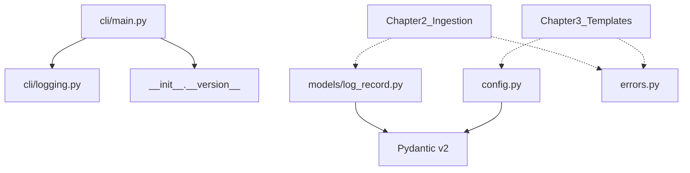

# Chapter 1 — Core models, config, and CLI skeleton

## Starting point (main @ Ch0 complete)

**Prerequisite satisfied.** Chapter 0 merged via PR #1 (`f5356c5` on `main`). Branch from `main` for Chapter 1 work.

### What exists today

| Area | Status |
|------|--------|
| Package | [`src/ontolog/__init__.py`](file:///home/schult_v/projects/ontolog/src/ontolog/__init__.py) (`__version__ = "0.0.1"`), [`py.typed`](file:///home/schult_v/projects/ontolog/src/ontolog/py.typed) |
| Tests | [`tests/unit/test_version.py`](file:///home/schult_v/projects/ontolog/tests/unit/test_version.py) (2 tests), empty [`conftest.py`](file:///home/schult_v/projects/ontolog/tests/conftest.py) |
| Tooling | ruff, mypy strict, pytest+coverage, Sphinx, pre-commit, CI (3.11 + 3.12) |
| Docs | `docs/` stub (getting_started, architecture, api, releasing) |
| Fixtures | [`tests/fixtures/loghub/README.md`](file:///home/schult_v/projects/ontolog/tests/fixtures/loghub/README.md) only — no `.log` files yet |

### Verified baseline (local)

```
ruff check src tests   → pass
mypy src               → pass (1 source file)
pytest                 → 2 passed
```

### Still missing (Chapter 1 scope)

- `LogRecord`, `config.py`, `errors.py`, `cli/`
- `typer` / `rich` runtime dependencies
- `[project.scripts]` entry point (`ontolog` console command)

### Housekeeping (optional, same PR or follow-up)

[`IMPLEMENTATION_PLAN.md`](IMPLEMENTATION_PLAN.md) tracks chapter status in [`.plans/`](README.md).

## Goal

Deterministic foundation with **no inference, no parsers, no Drain3**. Every downstream chapter imports from these modules.



## Target file layout

```text
src/ontolog/
├── __init__.py              # expand public API
├── config.py                # NEW
├── errors.py                # NEW
├── models/
│   ├── __init__.py          # NEW
│   └── log_record.py        # NEW
└── cli/
    ├── __init__.py          # NEW
    ├── main.py              # NEW — Typer app + entry point
    └── logging.py           # NEW — RichHandler setup

tests/unit/
├── test_log_record.py       # NEW
├── test_config.py           # NEW
├── test_errors.py           # NEW
└── test_cli.py              # NEW
```

---

## 1. `errors.py` — typed exception hierarchy

Mirror the pulq pattern in [`pulq/src/pulq/errors.py`](file:///home/schult_v/projects/pulq/src/pulq/errors.py): flat hierarchy under one base class.

| Class | Purpose | Ch1 scope |
|-------|---------|-----------|
| `OntologError` | Base | Implement |
| `ParseError` | Raw log line parse failure (Ch2) | Implement with optional `line`, `line_number` attrs |
| `TemplateError` | Drain3 / template store failure (Ch3) | Implement |
| `ConfigError` | Invalid settings | Implement |
| `StorageError` | SQLite / persistence (Ch3) | Stub class only |
| `InferenceError` | Inference pipeline (Ch6) | Stub class only |
| `ExportError` | Export layer (Ch8) | Stub class only |

`ParseError` is the only error with extra fields in Ch1:

```python
class ParseError(OntologError):
    def __init__(
        self,
        message: str,
        *,
        line: str | None = None,
        line_number: int | None = None,
    ) -> None: ...
```

All exceptions are plain `Exception` subclasses (not Pydantic models). Keep docstrings; no custom `__str__` unless needed.

---

## 2. `models/log_record.py` — `LogRecord` Pydantic model

Normalized representation of one log event. Chapter 2 parsers will populate this; Chapter 1 only defines the schema.

### Fields

| Field | Type | Required | Validation / notes |
|-------|------|----------|------------------|
| `timestamp` | `datetime \| None` | No | Timezone-aware UTC preferred; serializers use ISO 8601 |
| `hostname` | `str \| None` | No | Stripped; empty string coerced to `None` |
| `process` | `str \| None` | No | Service/process name |
| `pid` | `int \| None` | No | `Field(ge=1)` when set |
| `level` | `str \| None` | No | Normalized to uppercase on validation (`info` → `INFO`) |
| `logger` | `str \| None` | No | Logger/component name |
| `message` | `str` | **Yes** | Body only — metadata must not be duplicated (enforced by Ch2 parsers, not Ch1) |

### Model config

```python
class LogRecord(BaseModel):
    model_config = ConfigDict(frozen=True, extra="forbid")
```

- **Frozen** — log records are value objects passed through the pipeline.
- **`extra="forbid"`** — catch typos early (strict mypy + runtime safety).

### Serialization

Use Pydantic v2 built-ins only — no `to_json()` / `from_json()` wrappers:

- `LogRecord.model_dump_json()` — default kwargs (`indent=None`, etc.)
- `LogRecord.model_validate_json()` — round-trip in tests and Ch2 `ontolog ingest` JSONL output

Do not add custom serialization helpers in Ch1.

### Re-export from [`models/__init__.py`](file:///home/schult_v/projects/ontolog/src/ontolog/models/__init__.py)

```python
from ontolog.models.log_record import LogRecord
__all__ = ["LogRecord"]
```

---

## 3. `config.py` — settings scaffold

Pydantic `BaseModel` (not `pydantic-settings` yet — avoids a new dependency; env/file loading can land in Ch3+ when SQLite store needs it).

### `MaskKind` enum

Matches Chapter 3 masking list from the unified plan:

```python
class MaskKind(StrEnum):
    IP = "ip"
    UUID = "uuid"
    MAC = "mac"
    HEX = "hex"
    EMAIL = "email"
    NUMBER = "number"
    TIMESTAMP = "timestamp"
```

### `MaskConfig`

```python
class MaskConfig(BaseModel):
    model_config = ConfigDict(frozen=True)
    enabled: frozenset[MaskKind] = Field(
        default_factory=lambda: frozenset(MaskKind)
    )
```

All mask kinds enabled by default. Chapter 3 `templates/masking.py` will read `config.masks.enabled`.

### `ConfidenceThresholds`

Forward-looking defaults for Ch7 export eligibility (0.0–1.0 inclusive):

| Field | Default | Used by |
|-------|---------|---------|
| `export` | `0.7` | Ch8 — minimum confidence to include in exports |
| `field` | `0.5` | Ch6 — field type candidates |
| `entity` | `0.6` | Ch6 — entity candidates |
| `relationship` | `0.6` | Ch6 — relationship candidates |
| `event` | `0.5` | Ch6 — event candidates |

All fields: `Field(ge=0.0, le=1.0)`.

### `OntologConfig` (top-level)

```python
class OntologConfig(BaseModel):
    model_config = ConfigDict(frozen=True)
    masks: MaskConfig = Field(default_factory=MaskConfig)
    confidence: ConfidenceThresholds = Field(default_factory=ConfidenceThresholds)
    storage_path: Path = Path("ontolog.db")
```

### Factory

```python
def default_config() -> OntologConfig:
    return OntologConfig()
```

No file/env loading in Ch1. `ConfigError` raised only if validation fails (e.g. threshold > 1.0).

---

## 4. CLI — Typer skeleton + Rich logging

### Dependencies ([`pyproject.toml`](file:///home/schult_v/projects/ontolog/pyproject.toml))

Add to `[project] dependencies`:

```toml
"typer>=0.12",
"rich>=13.0",
```

Add entry point:

```toml
[project.scripts]
ontolog = "ontolog.cli.main:app"
```

`app` is the Typer instance (Typer convention for setuptools entry points).

### [`cli/logging.py`](file:///home/schult_v/projects/ontolog/src/ontolog/cli/logging.py)

```python
def setup_cli_logging(*, level: int = logging.INFO) -> None:
    """Configure stdlib logging with RichHandler for CLI use."""
```

- Use `rich.logging.RichHandler` with `show_path=False`, `rich_tracebacks=True`.
- Attach to root logger only when no handlers exist (idempotent — safe for tests).
- Set format: `"%(message)s"` (Rich adds level/time).
- Library modules use `logging.getLogger(__name__)` — no Rich import outside `cli/`.

### [`cli/main.py`](file:///home/schult_v/projects/ontolog/src/ontolog/cli/main.py)

```python
app = typer.Typer(
    name="ontolog",
    help="Probabilistic domain-model inference from application logs.",
    no_args_is_help=True,
    add_completion=False,
)
```

**`ontolog --version`** — eager callback on root (not a subcommand):

```python
def _version_callback(value: bool) -> None:
    if value:
        typer.echo(__version__)
        raise typer.Exit()

@app.callback()
def main(
    version: Annotated[
        bool | None,
        typer.Option("--version", callback=_version_callback, is_eager=True),
    ] = None,
) -> None:
    setup_cli_logging()
```

**`ontolog --help`** — automatic via Typer.

No subcommands in Ch1 (`ingest`, `templates`, etc. arrive in Ch2+).

### [`cli/__init__.py`](file:///home/schult_v/projects/ontolog/src/ontolog/cli/__init__.py)

Export `app` only; CLI is not part of the stable library API.

---

## 5. Update [`__init__.py`](file:///home/schult_v/projects/ontolog/src/ontolog/__init__.py) public API

```python
from ontolog.config import OntologConfig, default_config
from ontolog.errors import OntologError, ParseError, TemplateError, ConfigError
from ontolog.models import LogRecord

__all__ = [
    "__version__",
    "LogRecord",
    "OntologConfig",
    "default_config",
    "OntologError",
    "ParseError",
    "TemplateError",
    "ConfigError",
]
```

Do **not** export stub errors (`StorageError`, etc.) or CLI symbols until those features land.

---

## 6. Tests

### [`test_log_record.py`](file:///home/schult_v/projects/ontolog/tests/unit/test_log_record.py)

| Test | Assertion |
|------|-----------|
| `test_construct_minimal` | `message` only; optional fields `None` |
| `test_construct_full` | All fields set; `level` uppercased |
| `test_pid_validation` | `pid=0` raises `ValidationError` |
| `test_frozen` | Mutation raises |
| `test_json_round_trip` | `model_dump_json` → `model_validate_json` preserves values |
| `test_extra_forbidden` | Unknown field raises |

Use `datetime(2024, 1, 15, 12, 0, 0, tzinfo=UTC)` for timestamp tests.

### [`test_config.py`](file:///home/schult_v/projects/ontolog/tests/unit/test_config.py)

| Test | Assertion |
|------|-----------|
| `test_default_config` | All mask kinds enabled; default thresholds |
| `test_custom_masks` | Subset of `MaskKind` accepted |
| `test_threshold_bounds` | `1.1` raises `ValidationError` |
| `test_storage_path` | Accepts `Path` and string coercion |
| `test_frozen` | Mutation raises |

### [`test_errors.py`](file:///home/schult_v/projects/ontolog/tests/unit/test_errors.py)

| Test | Assertion |
|------|-----------|
| `test_hierarchy` | `ParseError` is `OntologError` is `Exception` |
| `test_parse_error_attrs` | `line`, `line_number` stored and accessible |

### [`test_cli.py`](file:///home/schult_v/projects/ontolog/tests/unit/test_cli.py)

Use `typer.testing.CliRunner`:

| Test | Assertion |
|------|-----------|
| `test_version_flag` | `runner.invoke(app, ["--version"])` exit 0, stdout == `__version__` + newline |
| `test_help` | `["--help"]` exit 0, contains "ontolog" and "version" |
| `test_no_args_shows_help` | `[]` exit 0 (because `no_args_is_help=True`) |

Import `app` from `ontolog.cli.main`.

Existing [`test_version.py`](file:///home/schult_v/projects/ontolog/tests/unit/test_version.py) stays unchanged.

---

## 7. CI / docs touch-ups

### [`.github/workflows/ci.yml`](file:///home/schult_v/projects/ontolog/.github/workflows/ci.yml) — wheel smoke test

Extend the install-from-wheel step:

```yaml
ontolog --version
python -c "import ontolog; print(ontolog.__version__)"
```

Confirms the console script resolves with runtime deps only.

### [`docs/api.md`](file:///home/schult_v/projects/ontolog/docs/api.md)

Add autodoc blocks for `ontolog.models`, `ontolog.config`, `ontolog.errors` (keep `cli` undocumented — not public API).

### [`CHANGELOG.md`](file:///home/schult_v/projects/ontolog/CHANGELOG.md)

Under `[Unreleased]`:

```markdown
### Added
- `LogRecord` model, `OntologConfig`, typed exceptions
- `ontolog` CLI with `--version` and `--help`
```

---

## 8. Implementation order

Execute in this sequence to keep each step importable and testable:

1. `errors.py`
2. `models/log_record.py` + `models/__init__.py`
3. `config.py`
4. `cli/logging.py` → `cli/main.py` → `cli/__init__.py`
5. `pyproject.toml` (deps + scripts)
6. `__init__.py` exports
7. Unit tests (errors → log_record → config → cli)
8. CI wheel test + docs api.md + CHANGELOG

After each batch: `ruff check`, `ruff format`, `mypy src`, `pytest`.

---

## 9. Acceptance criteria (Definition of Done)

- [ ] `pip install -e ".[dev]"` succeeds; `ontolog --version` prints `0.0.1`
- [ ] `ontolog --help` shows root help text
- [ ] `LogRecord` constructs, serializes to JSON, and round-trips via Pydantic
- [ ] `default_config()` returns valid defaults; invalid thresholds rejected
- [ ] `ParseError` / `TemplateError` / `ConfigError` importable from `ontolog`
- [ ] `ruff check`, `ruff format --check`, `mypy src`, `pytest` all green
- [ ] Wheel smoke test runs `ontolog --version` successfully
- [ ] No ingestion, template, or inference code added (scope guard)

---

## 10. Explicit non-goals (Ch1)

- No `pydantic-settings` / env var / TOML file loading
- No `types.py` Protocols (Ch4+)
- No `ontolog ingest` or other subcommands
- No log fixtures or parser tests (Ch2)
- No mask regex implementations (Ch3)
- No version bump beyond `0.0.1` (release in Ch12)

---

## Suggested PR

**Title:** `feat: add LogRecord, config, errors, and CLI skeleton`

**Branch:** `feat/ch1-core` (or similar) off `main`

**Scope:** ~12 new files, `pyproject.toml` + CI + docs api.md edits. Estimated ~400–500 LOC including tests.

**Pre-merge checklist:** run full local gate before push:

```bash
pip install -e ".[dev]"
ruff check src tests && ruff format --check src tests
mypy src
pytest
ontolog --version   # after entry point added
```
