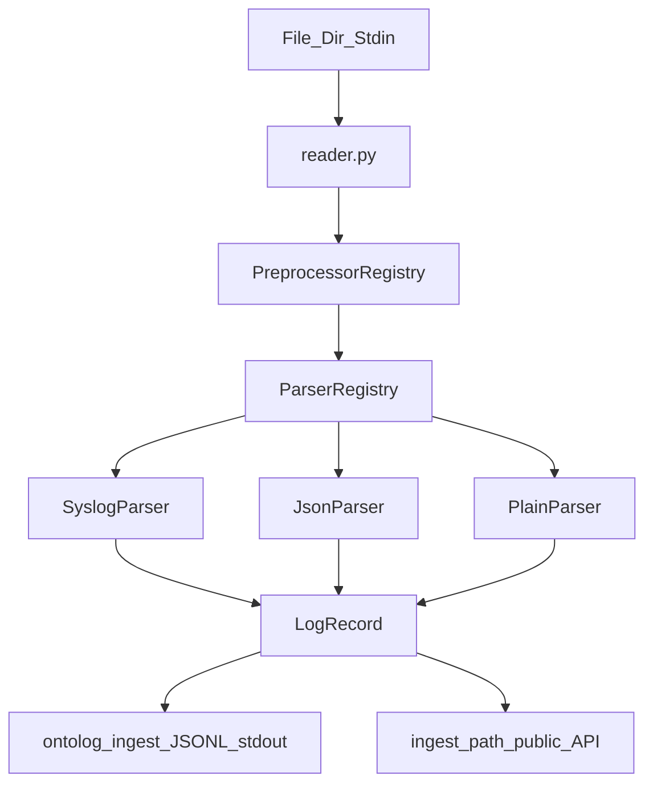

# Chapter 2 — Log ingestion and preprocessing

## Starting point (Chapter 1 complete)

| Area | Status |
|------|--------|
| [`LogRecord`](file:///home/schult_v/projects/ontolog/src/ontolog/models/log_record.py) | Frozen Pydantic model with 7 fields; JSON via `model_dump_json()` / `model_validate_json()` |
| [`ParseError`](file:///home/schult_v/projects/ontolog/src/ontolog/errors.py) | Has `line`, `line_number` attrs |
| [`cli/main.py`](file:///home/schult_v/projects/ontolog/src/ontolog/cli/main.py) | Typer root app; `--version` / `--help` only |
| Fixtures | [`tests/fixtures/loghub/README.md`](file:///home/schult_v/projects/ontolog/tests/fixtures/loghub/README.md) only — **no `.log` files yet** |
| `ingestion/` | Does not exist |

**Prerequisite gate:** `ruff check`, `mypy src`, `pytest` green on `main` with Ch1 merged.

---

## Goal

Normalize raw log files/streams into **`Iterator[LogRecord]`** with metadata separated from message body. No Drain3, no inference — Ch3 imports the output of this layer.



---

## Target file layout

```text
src/ontolog/
├── types.py                         # NEW — LogParser, Preprocessor Protocols
├── ingestion/
│   ├── __init__.py                  # re-exports ingest_path, parsers
│   ├── formats.py                   # LogFormat StrEnum + auto-detect
│   ├── parsers/
│   │   ├── __init__.py              # get_parser(), PARSER_REGISTRY
│   │   ├── base.py                  # shared helpers (strip, empty skip)
│   │   ├── syslog.py                # RFC3164, ISO8601, Apache bracket
│   │   ├── json.py                  # JSONL + journald field mapping
│   │   └── plain.py                 # whole-line message
│   ├── preprocessors.py             # PreprocessorRegistry (pulq HandlerRegistry analogue)
│   └── reader.py                    # file / directory / stdin streaming
└── cli/
    └── main.py                      # add ingest subcommand

tests/
├── fixtures/
│   ├── controlboard.log             # NEW — synthetic MVP fixture
│   ├── sample.jsonl                 # NEW — small JSONL unit-test fixture
│   └── loghub/
│       ├── apache_2k.log            # NEW — committed LogHub slice
│       └── openssh_2k.log         # NEW — committed LogHub slice
├── unit/
│   ├── test_parsers_syslog.py
│   ├── test_parsers_json.py
│   ├── test_parsers_plain.py
│   ├── test_preprocessors.py
│   ├── test_reader.py
│   └── test_cli_ingest.py
└── integration/
    └── test_ingest_fixtures.py      # end-to-end ingest on committed fixtures
```

---

## 1. `types.py` — Protocol contracts

Mirror pulq's [`types.py`](file:///home/schult_v/projects/pulq/src/pulq/types.py) pattern: structural typing, no ABC inheritance.

```python
class Preprocessor(Protocol):
    name: str
    def process(self, line: str, *, line_number: int) -> str: ...

class LogParser(Protocol):
    name: str
    def parse_line(self, line: str, *, line_number: int) -> LogRecord: ...
```

- Parsers raise `ParseError` (never bare `ValidationError` at the boundary).
- `ValidationError` from `LogRecord` construction is wrapped: `ParseError("invalid record", line=..., line_number=...)`.

**Public API:** export `LogParser`, `Preprocessor` from `ontolog.types` (not from `__init__.py` until Ch12 API freeze — document in Sphinx only).

---

## 2. `ingestion/formats.py` — format enum and auto-detect

```python
class LogFormat(StrEnum):
    SYSLOG = "syslog"
    JSON = "json"
    PLAIN = "plain"
    AUTO = "auto"
```

### Auto-detect heuristic (first 20 non-empty lines)

| Signal | Format |
|--------|--------|
| ≥80% lines parse as JSON objects (`json.loads` + `dict`) | `json` |
| ≥80% match syslog patterns (RFC3164, ISO8601, or Apache bracket) | `syslog` |
| Otherwise | `plain` |

Auto-detect runs on **preprocessed** lines. If ambiguous, prefer `syslog` over `plain` when any RFC3164 match exists (OpenSSH corpus).

---

## 3. Parsers — detailed behavior

### 3a. Shared rules (all parsers)

- Skip empty lines and whitespace-only lines (do not emit `LogRecord`, do not increment parse-error count).
- **Message body must not duplicate metadata** — timestamp, hostname, PID, level belong in fields, not repeated in `message`.
- Strip trailing whitespace from `message`; preserve internal spacing.
- Timestamps: parse to timezone-aware `datetime` (assume UTC when no tz offset; use `datetime` + `zoneinfo.UTC`).

### 3b. `SyslogParser` — covers OpenSSH 2k + controlboard + Apache 2k

Try patterns **in order** (first match wins):

**Pattern A — ISO8601 syslog** (controlboard fixture):

```text
2024-01-15T12:00:01.123Z cb-host controlboard[1001]: INFO PacketSent interface=eth0 destination=192.168.1.10 payload=0xdeadbeef
```

Regex groups: `timestamp`, `hostname`, `process`, `pid` (optional brackets), `level` (optional), `message`.

**Pattern B — RFC3164 BSD syslog** (OpenSSH 2k):

```text
Dec 10 06:55:46 LabSZ sshd[24200]: reverse mapping checking getaddrinfo ...
```

Groups: `timestamp` (no year — assume current year or year from ingest context; **use file mtime year or UTC current year with Dec→Jan rollover heuristic**), `hostname`, `process`, `pid`, `message`. No separate `level` field in raw OpenSSH lines → `level=None`.

**Pattern C — Apache error bracket** (Apache 2k):

```text
[Sun Dec 04 04:47:44 2005] [notice] workerEnv.init() ok /etc/httpd/conf/workers2.properties
```

Groups: `timestamp`, `level`, `message`. `hostname=None`, `process="apache"`, `pid=None`, `logger=None`.

If no pattern matches → `ParseError("unrecognized syslog line", ...)`.

### 3c. `JsonParser` — JSONL + journald + structlog

**Transport shape:** one JSON **object per line** (JSONL / NDJSON). This is **not** a single nested JSON document (no top-level array of records, no multi-line pretty-printed file). Each line is independently `json.loads()`-able.

Covered dialects under `LogFormat.JSON` (no separate enum value):

| Dialect | Typical source | Line shape |
|---------|----------------|------------|
| Generic JSONL | App logging, ELK/Filebeat | `{"message": "...", "timestamp": "..."}` |
| journald export | `journalctl -o json` | `{"_HOSTNAME": "...", "MESSAGE": "...", "PRIORITY": "6"}` |
| [structlog](https://www.structlog.org/en/stable/index.html) `JSONRenderer` | Python apps using structlog | `{"event": "hello", "level": "info", "timestamp": "..."}` |

**structlog specifics (Ch2):**

- structlog is **not** a runtime dependency — we only parse its serialized output.
- Default `JSONRenderer` emits **compact single-line JSON per log entry** ([docs](https://www.structlog.org/en/stable/getting-started.html#rendering)): `{"event": "hi"}`.
- The log message lives in **`event`**, not `message` (unless renamed via `EventRenamer` processor).
- Level comes from `add_log_level` processor as **`level`** or **`log_level`**.
- Timestamp from `TimeStamper` processor as **`timestamp`** (ISO string).
- Bound context (`peer_ip`, `user_id`, etc.) is **top-level keys** on the same object — values may be nested arrays/objects (e.g. `exception` tracebacks). Ch2 maps only the seven `LogRecord` fields; **extra keys are dropped** (they are not folded into `message`). Template/inference layers (Ch3+) operate on `message`/`event` text only for now.
- structlog **ConsoleRenderer** / **LogfmtRenderer** output is **not JSON** — route via `--format plain`, not `json`.

Example structlog line for fixtures/tests:

```json
{"event": "PacketSent", "level": "info", "timestamp": "2024-01-15T12:00:01.123456Z", "interface": "eth0", "destination": "192.168.1.10"}
```

→ `LogRecord(message="PacketSent", level="INFO", timestamp=..., process=None, ...)`.

#### Field mapping (first match wins per column)

| JSON key(s) | `LogRecord` field |
|-------------|-------------------|
| `@timestamp`, `timestamp`, `time`, `ts` | `timestamp` |
| `hostname`, `host`, `_HOSTNAME` | `hostname` |
| `process`, `syslog.ident`, `ident`, `app` | `process` |
| `pid`, `process_id` | `pid` |
| `level`, `log_level`, `severity`, `PRIORITY`, `syslog.priority` | `level` |
| `logger`, `logger_name`, `name`, `syslog.tag` | `logger` |
| `event`, `message`, `MESSAGE`, `msg`, `@message` | `message` |

- **Message key priority:** `event` before `message` (structlog default before generic).
- If no message key: `ParseError`.
- Extra JSON keys are ignored (not stored on `LogRecord` — `extra="forbid"` on model means parser must only pass known fields).
- Nested `MESSAGE` / `event` values (non-str): stringify via `json.dumps` as fallback.

### 3d. `PlainParser`

- `message` = stripped line content.
- All optional metadata fields `None`.
- Use for unstructured app logs and as auto-detect fallback.

---

## 4. `ingestion/preprocessors.py` — registry

Model after pulq [`HandlerRegistry`](file:///home/schult_v/projects/pulq/src/pulq/core/handler_registry.py):

```python
class PreprocessorRegistry:
    def __init__(self, *, default_chain: Sequence[str] = (), **preprocessors: Preprocessor): ...
    def register(self, preprocessor: Preprocessor) -> None: ...
    def get(self, name: str) -> Preprocessor: ...
    def apply(self, line: str, *, line_number: int, chain: Sequence[str] | None = None) -> str: ...
```

### Built-in preprocessors (Ch2)

| Name | Behavior |
|------|----------|
| `strip` | `line.strip()` (default, always first in chain) |
| `drop_utf8_bom` | Remove `\ufeff` prefix |
| `squash_whitespace` | Collapse runs of spaces/tabs in line (opt-in) |

- Default chain: `["strip"]`.
- CLI: repeatable `--preprocessor NAME` to append after defaults.
- Unknown preprocessor name → `ConfigError`.

**Extension point:** org-specific preprocessors (e.g., strip K8s pod prefix) register via `PreprocessorRegistry.register()` without forking parsers.

---

## 5. `ingestion/reader.py` — streaming reader

```python
@dataclass(frozen=True)
class IngestOptions:
    format: LogFormat = LogFormat.AUTO
  preprocessors: Sequence[str] = ()
    skip_errors: bool = False
    limit: int | None = None

def iter_lines(source: Path | str) -> Iterator[tuple[int, str]]:
    """Yield (line_number, text). source '-' means stdin."""

def iter_records(source: Path | str, options: IngestOptions) -> Iterator[LogRecord]:
    """Full pipeline: lines → preprocess → parse."""

def ingest_path(source: Path | str, options: IngestOptions | None = None) -> Iterator[LogRecord]:
    """Public API entry point."""
```

### Source resolution

| `source` | Behavior |
|----------|----------|
| `-` | Read `sys.stdin` line by line |
| File path | Single file |
| Directory | All `*.log` files, sorted by name, non-recursive (document; recursive is Ch9+ if needed) |
| Missing path | `FileNotFoundError` or `OntologError` with clear message |

### Error policy

- Default: first `ParseError` aborts iteration (raises).
- `skip_errors=True`: log warning via stdlib `logging`, continue.
- `limit=N`: stop after N successfully parsed records.

### Directory + format

- One format for entire directory (auto-detect samples lines from **first file only**).
- Line numbers reset per file; `ParseError.line_number` is per-file.

---

## 6. CLI — `ontolog ingest`

Add to [`cli/main.py`](file:///home/schult_v/projects/ontolog/src/ontolog/cli/main.py):

```text
ontolog ingest PATH [OPTIONS]

Arguments:
  PATH    Log file, directory of .log files, or "-" for stdin

Options:
  --format [syslog|json|plain|auto]   default: auto
  --preprocessor TEXT                 repeatable; runs after built-in strip
  --skip-errors / --no-skip-errors    default: --no-skip-errors
  --limit INTEGER                     max records emitted
```

**Output:** JSON Lines to stdout — one `LogRecord.model_dump_json()` per line, no indent.

**Stderr:** Rich logging for skip-errors warnings and summary (`ingested N records from PATH`).

**Examples:**

```bash
ontolog ingest tests/fixtures/controlboard.log
ontolog ingest tests/fixtures/loghub/openssh_2k.log --format syslog
ontolog ingest tests/fixtures/sample.jsonl --format json
cat tests/fixtures/controlboard.log | ontolog ingest -
```

---

## 7. Fixtures to commit (Ch2 scope)

### `tests/fixtures/controlboard.log` (synthetic, ~60–80 lines)

Designed for MVP inference in Ch6. Syslog ISO8601 format with repeating events:

```text
2024-01-15T12:00:01.123Z cb-host controlboard[1001]: INFO PacketSent interface=eth0 destination=192.168.1.10 payload=0xdeadbeef
2024-01-15T12:00:01.456Z cb-host controlboard[1001]: INFO PacketReceived interface=eth0 source=192.168.1.10 payload=0xbeefdead
2024-01-15T12:00:02.000Z cb-host controlboard[1001]: INFO ConnectionEstablished interface=eth0 peer=192.168.1.10
```

Include ~20 repetitions with varied IPs/payloads for template mining in Ch3.

### `tests/fixtures/sample.jsonl` (~6 lines)

Mix of:

- Generic JSONL (`message`, `timestamp`, `level`)
- journald-style (`_HOSTNAME`, `MESSAGE`, `PRIORITY`)
- structlog `JSONRenderer` lines (`event`, `level`, `timestamp` + bound context keys)

### LogHub 2k slices

Copy verbatim from LogHub repo (no transformation):

- [`Apache/Apache_2k.log`](https://github.com/logpai/loghub/blob/master/Apache/Apache_2k.log) → `tests/fixtures/loghub/apache_2k.log`
- [`OpenSSH/OpenSSH_2k.log`](https://github.com/logpai/loghub/blob/master/OpenSSH/OpenSSH_2k.log) → `tests/fixtures/loghub/openssh_2k.log`

Total committed size ~400 KB — acceptable for CI per unified plan.

---

## 8. Tests

### Unit tests — parsers

| File | Key cases |
|------|-----------|
| `test_parsers_syslog.py` | RFC3164 OpenSSH line; ISO8601 controlboard line; Apache bracket line; metadata not in message; malformed → `ParseError` |
| `test_parsers_json.py` | Generic JSONL; journald field names; structlog `event`/`log_level` mapping; missing message/event → `ParseError`; level normalized uppercase |
| `test_parsers_plain.py` | Whole line → message; blank line skipped at reader level |

### Unit tests — preprocessors & reader

| File | Key cases |
|------|-----------|
| `test_preprocessors.py` | Chain ordering; unknown name → `ConfigError`; BOM strip |
| `test_reader.py` | stdin via `io.StringIO` monkeypatch; directory ingest; `limit`; `skip_errors` continues; per-file line numbers |

### Unit tests — CLI

| File | Key cases |
|------|-----------|
| `test_cli_ingest.py` | `CliRunner` on controlboard.log; stdout is valid JSONL; `--format json`; `--limit 1`; exit code non-zero on parse error |

### Integration tests

`tests/integration/test_ingest_fixtures.py`:

| Fixture | Format | Assertions |
|---------|--------|------------|
| `controlboard.log` | auto/syslog | ≥50 records; all have non-empty `message`; `process == "controlboard"`; no message contains `cb-host` |
| `loghub/openssh_2k.log` | syslog | 2000 records; `process == "sshd"`; PIDs ≥1 |
| `loghub/apache_2k.log` | syslog | 2000 records; `level` in `{NOTICE, ERROR, ...}`; message does not start with `[` |
| `sample.jsonl` | json | round-trip field mapping |

Use parametrized tests; keep runtime < 2s.

---

## 9. Docs and changelog

### [`docs/api.md`](file:///home/schult_v/projects/ontolog/docs/api.md)

Add autodoc for `ontolog.ingestion`, `ontolog.types`.

### New [`docs/ingestion.md`](file:///home/schult_v/projects/ontolog/docs/ingestion.md) (short)

- Supported formats table (syslog, JSONL, plain) with JSONL dialects: generic, journald, structlog
- Note: structlog ConsoleRenderer/logfmt → use `--format plain`
- Preprocessor extension example
- Fixture provenance pointer to `tests/fixtures/loghub/README.md`

### [`docs/architecture.md`](file:///home/schult_v/projects/ontolog/docs/architecture.md)

Update `ingestion/` row from "planned" to implemented; link to `ingestion.md`.

### [`CHANGELOG.md`](file:///home/schult_v/projects/ontolog/CHANGELOG.md)

```markdown
### Added
- Log ingestion: syslog, JSONL, and plain parsers
- Preprocessor registry and streaming reader (file, directory, stdin)
- `ontolog ingest` CLI command (JSONL output)
- Fixtures: controlboard.log, LogHub apache_2k/openssh_2k slices
```

### [`.plans/README.md`](file:///home/schult_v/projects/ontolog/.plans/README.md)

Add chapter_2.plan.md link; mark Ch2 as pending/in-progress.

---

## 10. Implementation order

1. `types.py` (Protocols)
2. `ingestion/parsers/base.py` → `syslog.py` → `json.py` → `plain.py` → `parsers/__init__.py`
3. `ingestion/formats.py` (enum + auto-detect)
4. `ingestion/preprocessors.py`
5. `ingestion/reader.py` + `ingestion/__init__.py`
6. Fixtures (controlboard, sample.jsonl, loghub slices)
7. Unit tests (parsers → preprocessors → reader)
8. CLI `ingest` command
9. CLI + integration tests
10. Docs + CHANGELOG + `.plans/README.md`

After each batch: `ruff check`, `ruff format`, `mypy src`, `pytest`.

---

## 11. Acceptance criteria (Definition of Done)

- [ ] `ontolog ingest tests/fixtures/controlboard.log` prints valid JSONL; each line deserializes to `LogRecord`
- [ ] Message body does not duplicate hostname/timestamp/PID for syslog and JSON parsers
- [ ] OpenSSH + Apache 2k slices parse 2000 records each without error
- [ ] `ingest_path()` callable from Python API with same behavior as CLI
- [ ] Preprocessor registry accepts custom preprocessors
- [ ] `ruff check`, `ruff format --check`, `mypy src`, `pytest` all green
- [ ] No Drain3, template, evidence, or inference code added (scope guard)

---

## 12. Explicit non-goals (Ch2)

- No `pydantic-settings` / config file loading for ingest options
- No OpenTelemetry, Kafka, or network streaming sources
- No recursive directory walk or glob beyond `*.log`
- No `fetch_corpora.py` (Ch9)
- No template extraction or SQLite (Ch3)
- No format detection ML/heuristics beyond simple line sampling
- No version bump beyond `0.0.1`

---

## 13. Suggested PR

**Title:** `feat: add log ingestion parsers and ontolog ingest CLI`

**Branch:** `feat/ch2-ingestion` off `main`

**Scope:** ~18 new files, ~900–1100 LOC including tests and fixtures.

**Pre-merge checklist:**

```bash
pip install -e ".[dev]"
ruff check src tests && ruff format --check src tests
mypy src
pytest
ontolog ingest tests/fixtures/controlboard.log | head -1 | python -c "import sys; from ontolog import LogRecord; LogRecord.model_validate_json(sys.stdin.read())"
```

**Note:** Unified plan groups Ch1–2 in PR-2 ("Models + ingestion"). If Ch1 is not yet merged, either stack on the Ch1 branch or split into two PRs — prefer **one PR for Ch2 only** off `main` once Ch1 lands.
