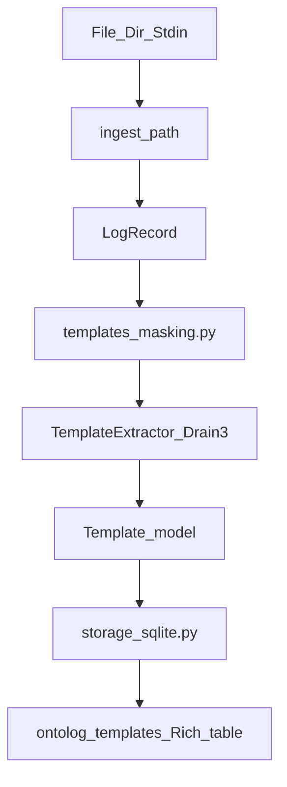

# Chapter 3 — Template extraction (Drain3)

## TDD methodology

Every capability follows **red → green → refactor** per [`.cursor/rules/tdd.mdc`](file:///home/schult_v/.cursor/rules/tdd.mdc):

1. **Red** — write tests asserting behavior; run `pytest <test_file>` and confirm meaningful failure (ImportError / missing behavior, not typos)
2. **Green** — smallest production change to pass
3. **Refactor** — clean up while re-running the narrow test file, then full suite

Run narrowest test command during each loop:

```bash
pytest tests/unit/test_template_model.py -x
```

Full gate after each cycle:

```bash
ruff check src tests && ruff format --check src tests && mypy src && pytest
```

---

## Starting point (Chapter 2 complete)

| Area | Status |
|------|--------|
| [`LogRecord`](file:///home/schult_v/projects/ontolog/src/ontolog/models/log_record.py) | Frozen Pydantic model; `message` is Drain3 input |
| [`ingest_path()`](file:///home/schult_v/projects/ontolog/src/ontolog/ingestion/reader.py) | Streaming `Iterator[LogRecord]` |
| [`MaskKind` / `MaskConfig`](file:///home/schult_v/projects/ontolog/src/ontolog/config.py) | Enum + enabled-set; no regex yet |
| [`TemplateError` / `StorageError`](file:///home/schult_v/projects/ontolog/src/ontolog/errors.py) | Defined; unused |
| Fixtures | `controlboard.log` present; LogHub 2k slices **missing** |
| `drain3` | Not in `pyproject.toml` |

---

## Goal

Compress `LogRecord.message` streams into stable parameterized templates via Drain3. Persist in SQLite. Expose via Python API and `ontolog templates` CLI.



---

## TDD Cycle 1 — Template model

### Red: `tests/unit/test_template_model.py`

| Test | Asserts |
|------|---------|
| `test_construct_minimal` | `Template(id, template)` defaults: `occurrence_count=1`, empty examples |
| `test_construct_full` | All fields including `first_seen`, `last_seen`, `examples` tuple |
| `test_occurrence_count_validation` | `occurrence_count=0` raises `ValidationError` |
| `test_frozen` | Mutation raises |
| `test_json_round_trip` | `model_dump_json` / `model_validate_json` |
| `test_template_parameter` | `TemplateParameter(name, value)` |
| `test_template_occurrence` | `TemplateOccurrence` with parameters tuple |

**Expected failure:** `ModuleNotFoundError: ontolog.models.template`

```bash
pytest tests/unit/test_template_model.py -x   # must fail
```

### Green: `src/ontolog/models/template.py`

```python
class Template(BaseModel):
    model_config = ConfigDict(frozen=True)
    id: str
    template: str
    occurrence_count: int = Field(ge=1, default=1)
    first_seen: datetime | None = None
    last_seen: datetime | None = None
    examples: tuple[str, ...] = ()
```

Also: `TemplateParameter`, `TemplateOccurrence`. Export `Template` from `models/__init__.py`.

### Refactor

- Match `log_record.py` style (validators, docstrings)
- Re-run `pytest tests/unit/test_template_model.py`

---

## TDD Cycle 2 — Masking

### Red: `tests/unit/test_masking.py`

| Test | Asserts |
|------|---------|
| `test_all_masks_enabled_returns_seven_instructions` | `len(build_masking_instructions(default)) == 7` |
| `test_subset_masks` | `enabled={IP, HEX}` → exactly 2 instructions |
| `test_ip_only_vs_number_only_produces_different_templates` | Same log line, different mask sets → different `template_mined` via Drain3 |
| `test_disabled_hex_not_labeled_hex` | With HEX disabled, template does not contain `<HEX>` |

**Expected failure:** `ImportError: ontolog.templates.masking`

Requires `drain3` in `pyproject.toml` for Drain3 integration tests in this file.

### Green: `src/ontolog/templates/masking.py`

- `build_masking_instructions(masks: MaskConfig) -> list[dict[str, str]]`
- `apply_mask_config(config: TemplateMinerConfig, masks: MaskConfig) -> None`
- Regex per `MaskKind`: IP, UUID, MAC, HEX (`0x[0-9a-fA-F]+`), EMAIL, NUMBER, TIMESTAMP
- `mask_with` = enum name uppercased

### Refactor

- Extract regex constants; verify instruction order is stable

---

## TDD Cycle 3 — Extractor

### Red: `tests/unit/test_extractor.py`

| Test | Asserts |
|------|---------|
| `test_single_record_returns_template` | `occurrence_count == 1`, non-empty `id` and `template` |
| `test_same_pattern_increments_count` | Two similar messages → one template, `occurrence_count == 2` |
| `test_controlboard_parameters_extracted` | HEX + IP parameter names/values from controlboard line |
| `test_empty_message_skipped` | Whitespace message not ingested; `templates()` unchanged |
| `test_templates_sorted_by_count` | `extract_templates()` returns descending by count |

**Expected failure:** `ImportError: ontolog.templates.extractor`

### Green: `src/ontolog/templates/extractor.py`

- `TemplateExtractor` dataclass with `ingest(record) -> Template`
- Drain3 `TemplateMiner` wired via `apply_mask_config`
- In-memory cluster dict; merge counts/timestamps/examples (cap 5)
- `ExtractOptions` + `extract_templates(source, options, ...)`

### Refactor

- Extract `_merge_template()` helper if merge logic grows

---

## TDD Cycle 4 — SQLite store

### Red: `tests/unit/test_sqlite_store.py`

| Test | Asserts |
|------|---------|
| `test_upsert_and_list` | Round-trip `Template` through store |
| `test_insert_occurrence` | Occurrence row persisted |
| `test_reload_in_new_instance` | New `SqliteTemplateStore(path)` sees same templates |
| `test_upsert_merges_counts_and_timestamps` | Second upsert adds counts, min/max timestamps |
| `test_storage_error_has_path` | `StorageError` carries `path` attr |

**Expected failure:** `ImportError: ontolog.storage.sqlite`

### Green: `src/ontolog/storage/sqlite.py`

- Schema v1: `templates`, `template_occurrences` tables
- `SqliteTemplateStore`: `upsert_template`, `insert_occurrence`, `list_templates`, `close`
- Enrich `StorageError` with optional `path: Path | None`

Wire store into `TemplateExtractor` when `store=` is set.

### Refactor

- Context manager `__enter__`/`__exit__` on store

---

## TDD Cycle 5 — CLI

### Red: `tests/unit/test_cli_templates.py`

| Test | Asserts |
|------|---------|
| `test_templates_command_exits_zero` | `CliRunner` on `controlboard.log` |
| `test_templates_output_contains_packet_sent` | stdout has `PacketSent` |
| `test_templates_status_on_stderr` | stderr has `extracted` status line |
| `test_templates_no_store_flag` | `--no-store` works without creating DB file |

**Expected failure:** `typer` exit or missing `templates` command

### Green

- `ontolog templates <path> [--store] [--no-store] [--format] [--skip-errors] [--limit]`
- `render_template_table()` in `cli/output.py` (Rich Table)
- Status via `echo_status` on stderr

### Refactor

- Share option parsing patterns with `ingest` command

---

## TDD Cycle 6 — Integration + fixtures

### Prerequisite (before red)

Add LogHub 2k slices to unblock existing Ch2 ingest tests and Ch3 smoke tests:

- `tests/fixtures/loghub/openssh_2k.log`
- `tests/fixtures/loghub/apache_2k.log`

### Red: `tests/integration/test_template_fixtures.py`

| Test | Asserts |
|------|---------|
| `test_controlboard_collapses_to_few_templates` | ≤5 templates; expect 3 families; `<IP>` and `<HEX>` in templates |
| `test_openssh_template_count_smoke` | Count in [25, 120] (calibrate on first green run) |
| `test_persistence_doubles_counts` | Two passes on same DB → stable IDs, ~2× occurrence counts |

### Green

- Wire full pipeline; calibrate openssh bounds if needed

### Refactor

- Parametrize fixture paths

---

## Target file layout

```text
src/ontolog/
├── models/template.py
├── templates/{__init__.py, masking.py, extractor.py}
├── storage/{__init__.py, sqlite.py}
└── cli/{main.py, output.py}          # extend

tests/
├── unit/{test_template_model,test_masking,test_extractor,test_sqlite_store,test_cli_templates}.py
├── integration/test_template_fixtures.py
└── fixtures/loghub/{apache_2k,openssh_2k}.log
```

---

## Dependency

Add to `pyproject.toml` before Cycle 2:

```toml
"drain3>=0.9.11",
```

---

## Acceptance criteria

- [ ] Each TDD cycle: red failure confirmed before green implementation
- [ ] `ontolog templates tests/fixtures/controlboard.log` → ~3 templates with `<IP>`/`<HEX>`
- [ ] OpenSSH 2k smoke band passes
- [ ] SQLite persistence across runs
- [ ] `ruff check`, `mypy src`, `pytest` green
- [ ] No evidence/inference/LLM code (scope guard)

---

## Explicit non-goals (Ch3)

- LogHub-2.0 F1 benchmark (Ch9)
- Drain3 Kafka/Redis persistence
- `ontolog infer` / evidence graph (Ch4+)
- Version bump beyond `0.0.1`

---

## Suggested PR

**Title:** `feat: add Drain3 template extraction and SQLite store`

**Branch:** `feat/ch3-templates`

```bash
pip install -e ".[dev]"
ruff check src tests && ruff format --check src tests
mypy src
pytest
ontolog templates tests/fixtures/controlboard.log
```
