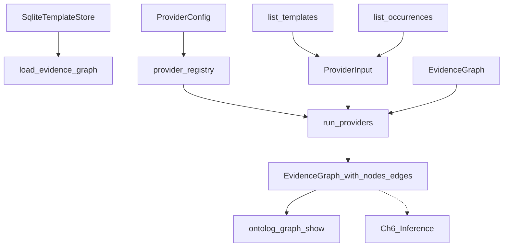

# Chapter 5 — Deterministic evidence providers

**Artifact path:** [`.plans/chapter_5.plan.md`](file:///home/schult_v/projects/ontolog/.plans/chapter_5.plan.md) (update [`.plans/README.md`](file:///home/schult_v/projects/ontolog/.plans/README.md) on completion)

## TDD methodology

Every capability follows **red → green → refactor** (same as [chapter_4.plan.md](file:///home/schult_v/projects/ontolog/.plans/chapter_4.plan.md)):

1. **Red** — write tests asserting behavior; run `pytest <test_file> -x` and confirm meaningful failure
2. **Green** — smallest production change to pass
3. **Refactor** — extract helpers; re-run narrow test file, then full gate

```bash
pytest tests/unit/test_provider_registry.py -x   # per cycle
ruff check src tests && ruff format --check src tests && mypy src && pytest
```

---

## Starting point (Chapter 4 complete)

| Area | Status |
|------|--------|
| [`Evidence`](file:///home/schult_v/projects/ontolog/src/ontolog/models/evidence.py) / [`EvidenceGraph`](file:///home/schult_v/projects/ontolog/src/ontolog/evidence/graph.py) | Frozen models + mutable graph service; JSON round-trip |
| [`load_evidence_graph()`](file:///home/schult_v/projects/ontolog/src/ontolog/evidence/loader.py) | **Stub** — always returns empty graph |
| [`SqliteTemplateStore`](file:///home/schult_v/projects/ontolog/src/ontolog/storage/sqlite.py) | `list_templates()`, `insert_occurrence()` — **no `list_occurrences()`** |
| [`types.py`](file:///home/schult_v/projects/ontolog/src/ontolog/types.py) | `LogParser`, `Preprocessor` Protocols — pattern to mirror |
| [`masking.py`](file:///home/schult_v/projects/ontolog/src/ontolog/templates/masking.py) | `_MASK_PATTERNS` for IP, UUID, MAC, HEX, EMAIL, NUMBER, TIMESTAMP |
| `providers/` | **Does not exist** |
| Fixtures | [`controlboard.log`](file:///home/schult_v/projects/ontolog/tests/fixtures/controlboard.log) (60 lines, 3 template families); `order_lifecycle.log` **not committed yet** |

---

## Goal

Generate semantics **without AI** by running deterministic analyzers over templates and occurrences, populating the evidence graph with typed nodes, relationship edges, and provenance-backed scores.



**Library-first rule:** All provider logic lives under `src/ontolog/providers/` and `src/ontolog/evidence/`. CLI [`graph --show`](file:///home/schult_v/projects/ontolog/src/ontolog/cli/graph/commands.py) only calls `load_evidence_graph()` — no provider logic in `cli/`.

```python
from pathlib import Path
from ontolog.config import default_config
from ontolog.evidence import load_evidence_graph

graph = load_evidence_graph(Path("ontolog.db"), config=default_config())
# Ch5: non-zero nodes/edges after templates + occurrences stored
```

---

## OOP / design conventions

| Layer | Pattern | Ch5 application |
|-------|---------|-----------------|
| Extension point | `Protocol` in [`types.py`](file:///home/schult_v/projects/ontolog/src/ontolog/types.py) | `EvidenceProvider` with `name` + `analyze` |
| Provider variants | One class per signal family (Rule of 3) | Six provider classes in `providers/` |
| Selection | Factory | `provider_registry(config) -> tuple[EvidenceProvider, ...]` |
| Orchestration | Module-level function | `run_providers(graph, input, providers)` in `evidence/runner.py` |
| Shared regex | Extract from masking | `templates/patterns.py` — single source for mask + provider regex |
| Scoring helper | Pure function | `evidence/scoring.py` — `reinforce_score(base, count)` |
| Domain values | Frozen Pydantic | `EvidenceFinding`, `ProviderInput` |
| Node IDs | Stable prefix scheme | `entity:`, `field:`, `type:`, `event:`, `rel:` |

**Protocol return type (refinement of unified plan):** The unified plan states `analyze(graph, templates) -> list[Evidence]`. Bare `Evidence` has no attachment target. Ch5 introduces **`EvidenceFinding`** — a frozen value pairing optional graph mutations with one `Evidence` record. The orchestrator applies findings via `_apply_finding(graph, finding)`.

**TypeCandidate (verify criterion):** No separate `TypeCandidate` model in Ch5. TYPE nodes (`NodeKind.TYPE`, e.g. `type:ipv4`, `type:hex`) plus FIELD nodes and edges carry the same information. Ch6 inference may promote these to `EntityCandidate` / domain types.

**Node ID convention:**

| Kind | Pattern | Example |
|------|---------|---------|
| Entity | `entity:{slug}` | `entity:controlboard` |
| Field | `field:{template_id}:{param}` | `field:cluster_1:destination` |
| Type | `type:{name}` | `type:ipv4` |
| Event | `event:{slug}` | `event:packet_sent` |
| Relationship edge | `rel:{a}+{b}` label | co-occurrence between fields |

---

## Prerequisite — shared patterns + store reads + config

Before TDD Cycle 1:

### 1. Extract regex patterns

Refactor [`masking.py`](file:///home/schult_v/projects/ontolog/src/ontolog/templates/masking.py) to import from new [`templates/patterns.py`](file:///home/schult_v/projects/ontolog/src/ontolog/templates/patterns.py):

- Move `_MASK_PATTERNS` → `MASK_PATTERNS: dict[MaskKind, str]`
- Add provider-only patterns in `TYPE_PATTERNS: dict[str, str]` for bool, URL, path, IPv6 (not in `MaskKind`)
- `masking.py` stays a thin adapter; providers import `TYPE_PATTERNS` + `MASK_PATTERNS`

### 2. `list_occurrences()` on store

Add to [`storage/queries.py`](file:///home/schult_v/projects/ontolog/src/ontolog/storage/queries.py) + [`sqlite.py`](file:///home/schult_v/projects/ontolog/src/ontolog/storage/sqlite.py):

```python
def list_occurrences(
    self, *, template_id: str | None = None
) -> list[TemplateOccurrence]: ...
```

Red tests in [`test_sqlite_store.py`](file:///home/schult_v/projects/ontolog/tests/unit/test_sqlite_store.py) before implementation.

### 3. `ProviderConfig` in [`config.py`](file:///home/schult_v/projects/ontolog/src/ontolog/config.py)

```python
class ProviderKind(StrEnum):
    REGEX = "regex"
    STATISTICS = "statistics"
    CO_OCCURRENCE = "co_occurrence"
    NAMESPACE = "namespace"
    TEMPORAL = "temporal"
    PROCESS = "process"

class ProviderConfig(BaseModel):
    model_config = ConfigDict(frozen=True)
    enabled: frozenset[ProviderKind] = Field(default_factory=lambda: frozenset(ProviderKind))

# Extend OntologConfig:
providers: ProviderConfig = Field(default_factory=ProviderConfig)
```

---

## TDD Cycle 1 — Protocol, findings, registry, orchestrator skeleton

### Red: `tests/unit/test_provider_registry.py`

| Test | Asserts |
|------|---------|
| `test_evidence_finding_construct` | `EvidenceFinding` with `evidence` + optional `node`/`edge` |
| `test_provider_input_construct` | `templates` + `occurrences` tuples |
| `test_registry_default_all_enabled` | `len(provider_registry(default_config().providers)) == 6` |
| `test_registry_respects_disabled` | Disable `REGEX` → registry excludes `RegexProvider` |
| `test_run_providers_empty_input` | Empty templates → graph stays empty, no error |
| `test_apply_finding_adds_node_with_evidence` | Orchestrator creates node from finding |

**Expected failure:** `ModuleNotFoundError: ontolog.providers`

### Green

| File | Contents |
|------|----------|
| [`models/finding.py`](file:///home/schult_v/projects/ontolog/src/ontolog/models/finding.py) | `EvidenceFinding`, `ProviderInput` (frozen Pydantic) |
| [`types.py`](file:///home/schult_v/projects/ontolog/src/ontolog/types.py) | `EvidenceProvider` Protocol |
| [`providers/base.py`](file:///home/schult_v/projects/ontolog/src/ontolog/providers/base.py) | `provider_registry()`, `DEFAULT_PROVIDER_ORDER` |
| [`evidence/runner.py`](file:///home/schult_v/projects/ontolog/src/ontolog/evidence/runner.py) | `run_providers()`, `_apply_finding()` |
| [`providers/__init__.py`](file:///home/schult_v/projects/ontolog/src/ontolog/providers/__init__.py) | export registry + provider classes (stubs returning `()`) |

```python
class EvidenceProvider(Protocol):
    @property
    def name(self) -> str: ...
    def analyze(
        self, graph: EvidenceGraph, data: ProviderInput
    ) -> tuple[EvidenceFinding, ...]: ...
```

Stub providers return empty tuples until their cycles land.

### Refactor

- `_apply_finding`: if `finding.node` set → `add_node` or `attach_evidence_to_node` if exists; same for edges
- Export `run_providers` from [`evidence/__init__.py`](file:///home/schult_v/projects/ontolog/src/ontolog/evidence/__init__.py)

---

## TDD Cycle 2 — RegexProvider

### Red: `tests/unit/test_provider_regex.py`

| Test | Asserts |
|------|---------|
| `test_ipv4_parameter_high_confidence` | `destination=192.168.1.10` → TYPE node `type:ipv4` + FIELD node; `score >= 0.9`, `source == "regex"` |
| `test_hex_parameter_high_confidence` | `payload=0xdeadbeef` → `type:hex`, `score >= 0.9` |
| `test_unknown_value_no_type_node` | `interface=eth0` → no ipv4/hex type finding |
| `test_samples_capped` | At most 5 sample values in `Evidence.samples` |
| `test_controlboard_templates_via_extractor` | Run extractor on [`controlboard.log`](file:///home/schult_v/projects/ontolog/tests/fixtures/controlboard.log); regex provider finds IP + HEX on parameters |

Use inline `Template` + `TemplateOccurrence` fixtures (no network).

### Green: [`providers/regex.py`](file:///home/schult_v/projects/ontolog/src/ontolog/providers/regex.py)

- Iterate occurrences' `parameters`; match each value against `TYPE_PATTERNS` (ordered: specific before generic)
- Emit findings: create FIELD node (if missing), TYPE node, edge `field --has_type--> type`, evidence on edge or field
- Base score: `0.95` for strong patterns (IP, UUID, MAC, HEX); `0.75` for NUMBER/bool

### Refactor

- Extract `_match_type(value: str) -> str | None` helper (~5 LOC)
- Reuse [`templates/patterns.py`](file:///home/schult_v/projects/ontolog/src/ontolog/templates/patterns.py)

---

## TDD Cycle 3 — StatisticsProvider + monotonic scoring

### Red: `tests/unit/test_provider_statistics.py` + `tests/unit/test_evidence_scoring.py`

| Test | Asserts |
|------|---------|
| `test_frequency_increases_score` | Same field value seen 1 vs 20 times → higher reinforced score |
| `test_cardinality_reported` | High-cardinality param gets lower frequency score than constant param |
| `test_entropy_finding` | Mixed values → entropy explanation in evidence |
| `test_reinforce_score_monotonic` (Hypothesis) | `reinforce_score(s, n) <= reinforce_score(s, n+1)` for `n in range(1, 100)` |
| `test_reinforce_score_bounded` | Result always in `[0, 1]` |

### Green

| File | Role |
|------|------|
| [`evidence/scoring.py`](file:///home/schult_v/projects/ontolog/src/ontolog/evidence/scoring.py) | `reinforce_score(base, observation_count) -> float` |
| [`providers/statistics.py`](file:///home/schult_v/projects/ontolog/src/ontolog/providers/statistics.py) | Per-parameter stats; attach/update evidence on existing FIELD nodes |

Statistics provider runs **after** RegexProvider in `DEFAULT_PROVIDER_ORDER` so FIELD nodes exist. If FIELD missing, create it.

### Refactor

- Pure `_shannon_entropy(values: Sequence[str]) -> float` helper
- Statistics attaches with `source="statistics"`; uses `reinforce_score` when prior evidence exists

---

## TDD Cycle 4 — CoOccurrenceProvider + fixture

### Red: `tests/unit/test_provider_cooccurrence.py`

Add committed fixture [`tests/fixtures/order_cooccurrence.log`](file:///home/schult_v/projects/ontolog/tests/fixtures/order_cooccurrence.log) (~10 lines):

```text
OrderCreated OrderID=ORD-001 CustomerID=CUST-42
OrderUpdated OrderID=ORD-001 CustomerID=CUST-42 status=validated
...
```

| Test | Asserts |
|------|---------|
| `test_co_occurring_params_create_relationship_edge` | `OrderID` + `CustomerID` in same occurrence → edge with `label="co_occurs"` |
| `test_relationship_score_increases_with_co_occurrence_count` | More joint occurrences → higher score |
| `test_non_co_occurring_params_no_edge` | Params never shared → no edge between their fields |

### Green: [`providers/co_occurrence.py`](file:///home/schult_v/projects/ontolog/src/ontolog/providers/co_occurrence.py)

- For each occurrence, pair parameter names; increment counter in `defaultdict`
- Emit `Edge` + `Evidence(source="co_occurrence", score=f(joint_count, total))`
- Score formula: `min(1.0, 0.5 + 0.05 * joint_count)` (document in explanation)

---

## TDD Cycle 5 — NamespaceProvider

### Red: `tests/unit/test_provider_namespace.py`

| Test | Asserts |
|------|---------|
| `test_process_name_yields_entity` | `controlboard[1001]` from log metadata → `entity:controlboard` |
| `test_token_pairs_yield_hierarchy` | Template `PacketSent interface=eth0` → entity `controlboard` (from process) + field/event tokens from message prefix |
| `test_interface_field_linked_to_entity` | Edge `entity:controlboard --has_field--> field:...:interface` |

Use controlboard templates + occurrences with `process="controlboard"`.

### Green: [`providers/namespace.py`](file:///home/schult_v/projects/ontolog/src/ontolog/providers/namespace.py)

Signals:
- Process name from occurrences → ENTITY node
- First token of template text (before params) → EVENT node candidate (`event:packet_sent`)
- `key=value` parameter names → FIELD nodes under owning entity

Keep heuristics simple and documented; no NLP.

---

## TDD Cycle 6 — TemporalProvider

### Red: `tests/unit/test_provider_temporal.py`

Add minimal [`tests/fixtures/order_lifecycle.log`](file:///home/schult_v/projects/ontolog/tests/fixtures/order_lifecycle.log) (synthetic, ~15 lines) with ordered events:

`created → validated → running → completed`

| Test | Asserts |
|------|---------|
| `test_ordered_template_sequence_edge` | Consecutive distinct template IDs → temporal edge with `label="follows"` |
| `test_same_template_not_self_loop` | Repeated template does not create `follows` self-edge |
| `test_score_reflects_sequence_length` | Longer observed sequence → higher temporal evidence |

### Green: [`providers/temporal.py`](file:///home/schult_v/projects/ontolog/src/ontolog/providers/temporal.py)

- Sort occurrences by `timestamp` (None last)
- Walk adjacent pairs; emit EVENT or template-sequence edges

---

## TDD Cycle 7 — ProcessProvider

### Red: `tests/unit/test_provider_process.py`

Reuse `order_lifecycle.log` or controlboard (repeating 3-template cycle).

| Test | Asserts |
|------|---------|
| `test_repeated_subsequence_detected` | Controlboard's `PacketSent → PacketReceived → ConnectionEstablished` cycle detected |
| `test_activity_graph_edge` | `label="repeats_in_process"` between event/template nodes |
| `test_min_support_threshold` | Subsequence seen once → no process finding (require `min_support=2`) |

### Green: [`providers/process.py`](file:///home/schult_v/projects/ontolog/src/ontolog/providers/process.py)

- Sliding window over template-id sequence; count length-3 tuples
- Emit process evidence when count ≥ `min_support` (default 2)

---

## TDD Cycle 8 — Wire `load_evidence_graph` + integration

### Red: `tests/unit/test_evidence_loader.py` (extend) + `tests/integration/test_provider_controlboard.py`

| Test | Asserts |
|------|---------|
| `test_load_after_templates_populates_graph` | Extract templates to store → `load_evidence_graph` → `node_count() > 0` |
| `test_load_respects_provider_config` | Disabled providers → fewer nodes than all-enabled |
| `test_controlboard_has_ipv4_and_hex_types` | TYPE nodes for ipv4 and hex present |
| `test_controlboard_has_controlboard_entity` | `entity:controlboard` exists |
| `test_cli_graph_show_nonzero_after_templates` | Extend [`test_cli_graph.py`](file:///home/schult_v/projects/ontolog/tests/unit/test_cli_graph.py) — store with templates → `nodes: N` where `N > 0` |

### Green: update [`loader.py`](file:///home/schult_v/projects/ontolog/src/ontolog/evidence/loader.py)

```python
def load_evidence_graph(store_path: Path, *, config: OntologConfig) -> EvidenceGraph:
    store = SqliteTemplateStore(store_path)
    try:
        templates = store.list_templates()
        occurrences = store.list_occurrences()
        graph = EvidenceGraph()
        providers = provider_registry(config.providers)
        run_providers(
            graph,
            ProviderInput(templates=tuple(templates), occurrences=tuple(occurrences)),
            providers,
        )
        return graph
    finally:
        store.close()
```

**Pre-alpha API rule:** Breaking changes to `load_evidence_graph` are fine. Require `config` explicitly — no optional fallback. Call sites that want defaults pass `default_config()`; update CLI and all tests in the same cycle.

### Refactor

- Update [`cli/graph/commands.py`](file:///home/schult_v/projects/ontolog/src/ontolog/cli/graph/commands.py) to pass `default_config()` (or load from future config file)
- Replace Ch4 stub tests in [`test_evidence_loader.py`](file:///home/schult_v/projects/ontolog/tests/unit/test_evidence_loader.py): `test_load_returns_empty_graph` → `test_load_empty_store_returns_empty_graph`; all loader tests pass `config=default_config()`

---

## Target file layout

```text
src/ontolog/
├── config.py                       # + ProviderKind, ProviderConfig
├── types.py                        # + EvidenceProvider Protocol
├── models/
│   ├── finding.py                  # NEW — EvidenceFinding, ProviderInput
│   └── __init__.py                 # extend exports
├── templates/
│   ├── patterns.py                 # NEW — shared regex (extracted from masking)
│   └── masking.py                  # REFACTOR — import patterns
├── storage/
│   ├── queries.py                  # + LIST_OCCURRENCES
│   └── sqlite.py                   # + list_occurrences()
├── evidence/
│   ├── scoring.py                  # NEW
│   ├── runner.py                   # NEW — run_providers
│   ├── loader.py                   # EXTEND — run providers
│   └── __init__.py                 # export run_providers
└── providers/
    ├── __init__.py
    ├── base.py                     # registry + order
    ├── regex.py
    ├── statistics.py
    ├── co_occurrence.py
    ├── namespace.py
    ├── temporal.py
    └── process.py

tests/
├── fixtures/
│   ├── order_cooccurrence.log      # NEW
│   └── order_lifecycle.log         # NEW
├── unit/
│   ├── test_provider_registry.py   # NEW
│   ├── test_provider_regex.py      # NEW
│   ├── test_provider_statistics.py # NEW
│   ├── test_provider_cooccurrence.py
│   ├── test_provider_namespace.py
│   ├── test_provider_temporal.py
│   ├── test_provider_process.py
│   ├── test_evidence_scoring.py    # NEW — Hypothesis
│   ├── test_evidence_loader.py     # EXTEND
│   ├── test_sqlite_store.py        # EXTEND
│   └── test_cli_graph.py           # EXTEND
└── integration/
    └── test_provider_controlboard.py  # NEW
```

---

## Provider execution order

```python
DEFAULT_PROVIDER_ORDER: tuple[ProviderKind, ...] = (
    ProviderKind.NAMESPACE,      # entities/events/fields first
    ProviderKind.REGEX,          # type inference on parameters
    ProviderKind.STATISTICS,     # reinforce / entropy
    ProviderKind.CO_OCCURRENCE,  # relationship edges
    ProviderKind.TEMPORAL,       # sequence edges
    ProviderKind.PROCESS,        # repeated activity patterns
)
```

---

## Documentation updates (post-implementation)

- [`docs/architecture.md`](file:///home/schult_v/projects/ontolog/docs/architecture.md) — provider pipeline section
- [`docs/api.md`](file:///home/schult_v/projects/ontolog/docs/api.md) — `run_providers`, provider classes, `ProviderConfig`
- [`CHANGELOG.md`](file:///home/schult_v/projects/ontolog/CHANGELOG.md) — Ch5 entry
- [`.plans/README.md`](file:///home/schult_v/projects/ontolog/.plans/README.md) — add chapter_5 row; mark Ch5 complete

---

## Acceptance criteria

- [ ] Each TDD cycle: red failure confirmed before green implementation
- [ ] Six providers behind `EvidenceProvider` Protocol; registry honors enable/disable
- [ ] IP and hex parameters in controlboard templates → TYPE nodes with `score >= 0.9`, `source="regex"`
- [ ] `OrderID` + `CustomerID` co-occurrence fixture → relationship edge with increasing score
- [ ] `reinforce_score` monotonic under Hypothesis property test
- [ ] All provider tests use fixtures only — no network, no LLM
- [ ] `load_evidence_graph()` populates graph from stored templates + occurrences
- [ ] `ontolog graph --show` reports non-zero nodes after template extraction
- [ ] `ruff check`, `mypy src`, `pytest` green

---

## Explicit non-goals (Ch5)

- `EntityCandidate`, `RelationshipCandidate`, inference orchestration (Ch6)
- `ProbabilisticDomainModel`, aggregation (Ch7)
- Graph SQLite persistence
- `ontolog infer` command (Ch9)
- LLM / semantic providers (Ch10)
- Bayesian update beyond simple `reinforce_score` (Ch7)
- Backward-compatible `load_evidence_graph` signatures (pre-alpha — break freely)

---

## Suggested PR

**Title:** `feat: add deterministic evidence providers`

**Branch:** `feat/ch5-evidence-providers`

```bash
pip install -e ".[dev]"
ruff check src tests && ruff format --check src tests
mypy src
pytest
ontolog templates tests/fixtures/controlboard.log --store /tmp/ontolog.db
ontolog graph --show --store /tmp/ontolog.db
```

**Commit message:**

```
feat(providers): add deterministic evidence providers

Introduces six providers, registry config, run_providers orchestrator,
shared regex patterns, list_occurrences store API, and graph population
via load_evidence_graph.
```
