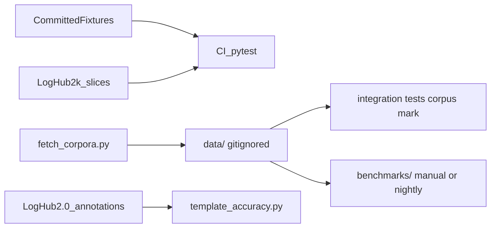
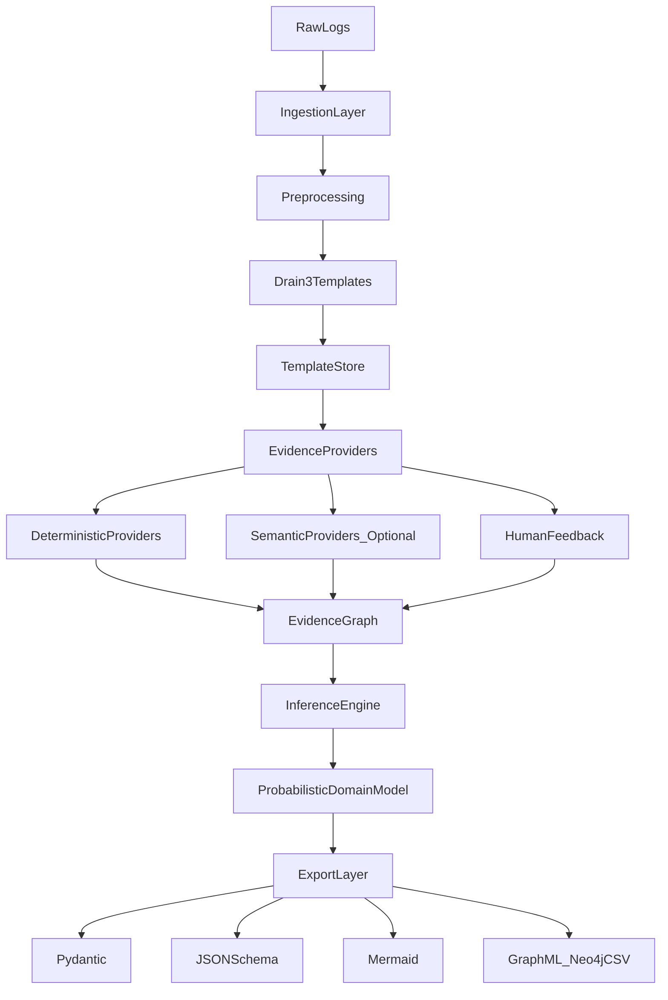
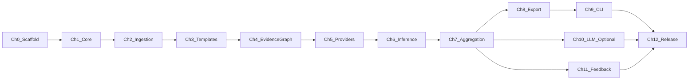

# Ontolog Unified Implementation Plan

## Vision (merged from both plans)

**Ontolog** transforms unstructured application logs into an **explainable, probabilistic domain model** with confidence scores and provenance. It is **not** a SIEM, log viewer, or LLM wrapper — it is a **library-first inference engine**.

**Core principles** (non-negotiable across all chapters):

- Deterministic core first — full pipeline works without any LLM
- LLMs are optional evidence providers, never the source of truth
- Templates (via Drain3) are the semantic boundary between raw logs and inference
- Graph-native representation — Pydantic/JSON Schema/Mermaid are derived exports
- Human feedback is first-class evidence with highest weight

**Target MVP outcome** (controlboard logs fixture):

```
Entities: ControlBoard, Interface
Events: PacketSent, PacketReceived, ConnectionEstablished
Fields: payload (bytes, ~0.98), destination (IPv4Address, 1.0)
Relationship: ControlBoard owns Interface
```

Each claim must carry confidence + provenance trail.

---

## Repository structure (modeled on [pulq](file:///home/schult_v/projects/pulq))

Ontolog is greenfield today ([LICENSE](file:///home/schult_v/projects/ontolog/LICENSE) only). Scaffold the full project skeleton in **Chapter 0** before feature work.

```text
ontolog/
├── src/ontolog/              # src layout (like pulq/src/pulq/)
│   ├── __init__.py           # public API + __version__
│   ├── types.py              # Protocols, type aliases
│   ├── errors.py
│   ├── config.py             # Pydantic settings
│   ├── models/               # LogRecord, Template, Evidence, DomainModel
│   ├── ingestion/            # parsers, preprocessor registry
│   ├── templates/            # Drain3 adapter, masking, store
│   ├── evidence/             # EvidenceGraph, provider base
│   ├── providers/            # deterministic + semantic providers
│   ├── inference/            # aggregation, event/entity/relationship/state
│   ├── export/               # pydantic, json-schema, mermaid, graphml
│   ├── feedback/             # human correction evidence
│   ├── storage/              # SQLite persistence
│   └── cli/                  # Typer entry point: ontolog
├── tests/
│   ├── conftest.py
│   ├── unit/
│   ├── integration/
│   └── fixtures/             # controlboard.log, loghub/ 2k slices, synthetic
├── docs/                     # Sphinx + MyST (like pulq/docs/)
├── examples/                 # runnable demos
├── benchmarks/               # template + inference perf + accuracy vs LogHub-2.0
├── scripts/
│   └── fetch_corpora.py      # on-demand LogHub download (Zenodo)
├── .github/workflows/        # ci.yml, release.yml, publish.yml
├── .github/dependabot.yml
├── .pre-commit-config.yaml
├── .readthedocs.yaml
├── pyproject.toml            # single config source
├── README.md
├── CHANGELOG.md
├── CONTRIBUTING.md
└── LICENSE
```

**Tooling parity with pulq** ([pyproject.toml](file:///home/schult_v/projects/pulq/pyproject.toml), [ci.yml](file:///home/schult_v/projects/pulq/.github/workflows/ci.yml), [.readthedocs.yaml](file:///home/schult_v/projects/pulq/.readthedocs.yaml)):

| Concern | Choice |
|---------|--------|
| Python | `>=3.11` (CI matrix 3.11 + 3.12; match pulq, not 3.13-only) |
| Build | setuptools src layout |
| Lint/format | Ruff |
| Types | mypy strict |
| Tests | pytest + pytest-cov + hypothesis |
| CLI | Typer + Rich; entry point `ontolog` |
| Docs | Sphinx + MyST + RTD theme; hosted at `ontolog.readthedocs.io` |
| CI | GitHub Actions: ruff, mypy, pytest+coverage, Sphinx `-W`, wheel smoke test |
| Release | Tag `v<version>` from pyproject on merge to main; PyPI OIDC trusted publishing |
| Coverage | Codecov upload from CI |
| Optional extras | `semantic` (OpenAI/Anthropic/etc.), `graph` (Neo4j export), `dev`, `docs` |

**Core dependencies:** `pydantic>=2`, `drain3`, `networkx`, `typer`, `rich`, `typing-extensions`

**Deferred (post-MVP):** DuckDB, Polars, Neo4j driver, OpenTelemetry ingestion

---

## Benchmark corpora (testing and evaluation)

Ontolog is **not** an ML training project — there is no model to fit on log data. Public corpora are used for **regression testing**, **template-mining benchmarks**, **provider/inference smoke tests**, and **optional performance runs**. No large datasets are committed to git.

### Primary source: LogHub

[LogHub](https://github.com/logpai/loghub) (Zenodo [8196385](https://zenodo.org/records/8196385)) is the standard corpus for log analytics research: **19 real-world, line-based datasets** (~77 GB total), freely available for research with citation requirements.

| Tier | Datasets | Size | Use in Ontolog |
|------|----------|------|----------------|
| **CI fixtures** | Apache, Linux, Zookeeper, HPC | < 5 MB each | Committed truncated slices in `tests/fixtures/loghub/` |
| **Integration** | HealthApp, OpenSSH, Spark | 5–200 MB | Downloaded on demand; integration tests marked `@pytest.mark.corpus` |
| **Benchmark** | HDFS_v1, BGL, Hadoop | 100 MB–2 GB | Template throughput + provider scale tests (manual/nightly job) |
| **Out of scope (V1)** | Thunderbird, HDFS_v2 | 10–30 GB | Too large for routine CI; document as optional |

Log formats vary (syslog-like supercomputer logs, Hadoop text, Android, web server errors) — good coverage for ingestion parsers and masking rules.

### Template ground truth: LogHub-2.0

[LogHub-2.0](https://github.com/logpai/loghub-2.0) (Zenodo [8275861](https://zenodo.org/record/8275861)) provides **annotated template labels** for log-parsing benchmarks. The bundled `2k_dataset/` (2,000 lines per dataset) is ideal for Ontolog:

- Validate Drain3 adapter output against known templates (precision/recall/F1)
- Regression-test masking config changes
- Compare Ontolog template counts vs published parser benchmarks

### Domain-specific fixture (committed)

| Fixture | Source | Purpose |
|---------|--------|---------|
| `controlboard.log` | Project plans (synthetic) | MVP entity/event/field inference target |
| `order_lifecycle.log` | Synthetic | Entity lifecycle + state-machine tests |
| `loghub/apache_2k.log` | LogHub-2k slice | Parser + template smoke test |
| `loghub/openssh_2k.log` | LogHub-2k slice | Drain3 example parity (Drain3 docs use SSH logs) |

### Supplementary sources (post-MVP)

| Source | Notes |
|--------|-------|
| [RCAEval](https://zenodo.org/records/14590730) | Microservice logs bundled with metrics/traces; useful later for multi-modal but heavy |
| Synthetic generators (e.g. [edgedelta/loadgen](https://github.com/edgedelta/loadgen)) | Scale/throughput only; no semantic ground truth |
| Org-specific logs | User-provided; out of repo |

### Repository layout for corpora

```text
ontolog/
├── tests/fixtures/
│   ├── controlboard.log          # committed
│   ├── order_lifecycle.log       # committed
│   └── loghub/                   # committed 2k slices only
│       ├── apache_2k.log
│       ├── openssh_2k.log
│       └── README.md             # provenance + citation
├── data/                         # gitignored; full downloads land here
│   └── loghub/                   # e.g. HealthApp.tar.gz extracted
├── scripts/
│   └── fetch_corpora.py          # download + verify checksums from Zenodo
└── benchmarks/
    ├── template_throughput.py
    ├── template_accuracy.py      # compare vs LogHub-2.0 labels
    └── inference_latency.py
```

### Corpus workflow



**CI policy:**
- Default `pytest` runs only on committed fixtures (< 1 MB total) — fast, no network
- `pytest -m corpus` runs after `scripts/fetch_corpora.py --tier integration`
- `benchmarks/template_accuracy.py` runs in a separate GitHub Actions workflow (`benchmark.yml`, weekly/manual, not PR-blocking)

**Citation:** `docs/benchmarks.md` and `tests/fixtures/loghub/README.md` must cite LogHub ([ISSRE 2023 paper](https://github.com/logpai/loghub/blob/master/CITATION)).

### Where corpora touch chapters

| Chapter | Corpus integration |
|---------|-------------------|
| Ch0 | Add `data/` to `.gitignore`; `tests/fixtures/loghub/README.md` |
| Ch2 | Parser tests against `apache_2k.log`, `openssh_2k.log` |
| Ch3 | Template accuracy benchmark vs LogHub-2.0 labels; Drain3 regression |
| Ch5–6 | Synthetic `order_lifecycle.log` + optional HealthApp integration |
| Ch9 | `fetch_corpora.py`; `benchmarks/template_accuracy.py`; docs |
| Ch12 | Document corpus tiers in `docs/benchmarks.md`; optional weekly benchmark workflow |

---

## Architecture



---

## Implementation chapters

Each chapter ends with **verifiable acceptance criteria** — CI must stay green before moving on.

---

### Chapter 0 — Repository scaffold and engineering baseline

**Goal:** Empty-but-runnable Python library project with green CI/CD, matching pulq conventions.

**Deliverables:**
- [pyproject.toml](file:///home/schult_v/projects/ontolog/pyproject.toml) with project metadata, `[dev]`/`[docs]` extras, ruff/mypy/pytest/coverage config
- `src/ontolog/__init__.py` with `__version__` and `py.typed`
- `.github/workflows/ci.yml`, `release.yml`, `publish.yml`, `dependabot.yml`
- `.pre-commit-config.yaml` (ruff hooks)
- `.readthedocs.yaml` + minimal `docs/` (index, getting_started, architecture stub)
- `README.md` with badges (CI, RTD, PyPI placeholder, codecov, ruff, mypy)
- `CHANGELOG.md`, `CONTRIBUTING.md`, `.gitignore` (include `data/`)
- `tests/fixtures/loghub/README.md` — provenance and citation for committed 2k slices
- Commit existing planning docs or fold key content into `docs/architecture.md`

**Verify:**
- `pip install -e ".[dev]"` succeeds
- `ruff check`, `ruff format --check`, `mypy src`, `pytest` all pass (smoke test only)
- `sphinx-build -W docs _build/html` passes locally and on RTD
- GitHub Actions CI green on `main`
- `python -c "import ontolog"` works after wheel build

---

### Chapter 1 — Core models, config, and CLI skeleton

**Goal:** Deterministic foundation with no inference yet.

**Deliverables:**
- `LogRecord` Pydantic model (`timestamp`, `hostname`, `process`, `pid`, `level`, `logger`, `message`)
- `config.py` — settings for masks, confidence thresholds, storage path
- `errors.py` — typed exceptions (`ParseError`, `TemplateError`, etc.)
- Typer CLI group: `ontolog --version`, `ontolog --help`
- Structured logging via stdlib `logging` (Rich handler in CLI)

**Verify:**
- Unit tests construct/serialize `LogRecord`
- `ontolog --version` prints version from `__init__.py`
- mypy strict passes on all models

---

### Chapter 2 — Log ingestion and preprocessing

**Goal:** Normalize raw logs into `LogRecord` streams.

**Deliverables:**
- `ingestion/parsers/` — syslog, plain text, JSON lines (journald export as JSON variant)
- `ingestion/preprocessors.py` — registry pattern for org-specific pipelines
- `ingestion/reader.py` — file, directory, stdin streaming
- CLI: `ontolog ingest <path> [--format syslog|json|plain]`

**Verify:**
- Fixture tests parse representative syslog, JSON, plain lines, and LogHub Apache/OpenSSH 2k slices into `LogRecord`
- Message body separated from metadata (timestamp/host/PID not duplicated in message)
- `ontolog ingest tests/fixtures/controlboard.log` emits normalized JSON lines to stdout

---

### Chapter 3 — Template extraction (Drain3)

**Goal:** Compress logs into stable, parameterized templates.

**Deliverables:**
- `templates/extractor.py` — `TemplateExtractor.ingest(record) -> Template`
- `Template` model (`id`, `template`, `occurrence_count`, `first_seen`, `last_seen`, `examples`)
- `templates/masking.py` — configurable masks (IP, UUID, MAC, hex, email, numbers, timestamps)
- `storage/sqlite.py` — tables: `templates`, `template_occurrences`
- CLI: `ontolog templates <path> [--store ontolog.db]`

**Verify:**
- Repeated controlboard lines collapse to few templates with extracted parameters
- OpenSSH 2k slice produces template count within expected range (smoke assertion)
- Mask config changes tokenization predictably (unit test)
- SQLite store persists and reloads templates across runs
- `ontolog templates` prints template summary table (Rich)

---

### Chapter 4 — Evidence graph foundation

**Goal:** Central graph abstraction for all inference.

**Deliverables:**
- `models/evidence.py` — `Evidence`, `Node`, `Edge`, `NodeKind` (ENTITY, FIELD, EVENT, TYPE, STATE, RELATIONSHIP)
- `evidence/graph.py` — `EvidenceGraph` wrapping NetworkX
- Attach `Evidence` (source, score, explanation, samples) to nodes/edges
- Serialization: graph to/from JSON for debugging

**Verify:**
- Unit tests add/query nodes and edges with attached evidence
- `ontolog graph --show` (stub) loads store and prints node/edge counts
- Graph round-trip JSON serialization is lossless

---

### Chapter 5 — Deterministic evidence providers

**Goal:** Generate semantics without AI.

**Deliverables in `providers/`:**
| Provider | Signals |
|----------|---------|
| `RegexProvider` | IPv4/6, UUID, MAC, hex, int, float, bool, email, URL, path, timestamp |
| `StatisticsProvider` | frequency, cardinality, entropy, length distribution |
| `CoOccurrenceProvider` | tokens/parameters appearing together |
| `NamespaceProvider` | `controlboard interface` → entity hierarchy |
| `TemporalProvider` | ordered template sequences |
| `ProcessProvider` | repeated event sequences / activity graphs |

- `EvidenceProvider` Protocol: `analyze(graph, templates) -> list[Evidence]`
- Provider registry with enable/disable config

**Verify:**
- IP and hex parameters in controlboard templates get `TypeCandidate` with high confidence
- Co-occurring `OrderID`+`CustomerID` fixture increases relationship score
- Repeated observations monotonically increase confidence (property test with hypothesis)
- All provider tests use fixtures only — no network, no LLM

---

### Chapter 6 — Inference engine (events, entities, relationships, states)

**Goal:** Turn raw evidence into structured domain concepts.

**Deliverables in `inference/`:**
- `events.py` — verb/position/frequency → `EventCandidate` (connect, send, receive, create, delete, update)
- `entities.py` — lifecycle verbs + shared identifiers + noun phrases → `EntityCandidate`
- `relationships.py` — co-occurrence, dependency, shared IDs → `RelationshipCandidate`
- `states.py` — transition graphs, Markov/process-mining heuristics → state machine candidates
- Orchestrator runs providers then inference passes in defined order

**Verify:**
- Controlboard fixture produces `ControlBoard`, `Interface`, `PacketSent`, `PacketReceived`
- `payload` and `destination` fields inferred with documented confidence
- `ControlBoard owns Interface` relationship suggested
- State sequence `created → validated → running → completed` detected from synthetic fixture

---

### Chapter 7 — Probabilistic aggregation and domain model

**Goal:** Merge multi-source evidence into stable, explainable model.

**Deliverables:**
- `models/domain.py` — `ProbabilisticDomainModel`, `Entity`, `Event`, `Field`, `Relationship`, `StateMachine`
- `inference/aggregate.py` — weighted averaging / Bayesian update; keep top + alternative candidates
- Configurable confidence thresholds for export eligibility
- Full provenance: every claim traceable to evidence sources

**Verify:**
- Conflicting evidence resolves per configured weights; human > deterministic > LLM
- Model JSON export includes confidence + provenance for every field
- Same evidence graph → deterministic model output (reproducibility test)

---

### Chapter 8 — Export layer

**Goal:** Make inferred model useful for developers.

**Deliverables in `export/`:**
- `pydantic_gen.py` — generate Python model source from high-confidence entities
- `json_schema.py` — JSON Schema export
- `mermaid.py` — ER diagrams + state-transition diagrams
- `markdown_report.py` — human-readable summary
- `graphml.py` — GraphML export (Neo4j CSV behind `[graph]` extra)
- CLI: `ontolog export pydantic|json-schema|mermaid|markdown|graphml`

**Verify:**
- `ontolog export pydantic` emits importable code passing `ruff` + `mypy`
- Mermaid output renders valid ER diagram for controlboard model
- JSON Schema validates a sample instance
- Exports respect confidence threshold config

---

### Chapter 9 — End-to-end CLI and examples

**Goal:** Single-command workflow for analysts.

**Deliverables:**
- `ontolog infer <path>` — full pipeline: ingest → templates → providers → inference → model
- `ontolog export <format>` — export from last run or `--db`
- `examples/controlboard.py` — programmatic API usage
- `examples/basic_cli.sh` — shell demo
- `scripts/fetch_corpora.py` — download LogHub tiers from Zenodo with checksum verification
- `benchmarks/template_throughput.py`, `benchmarks/inference_latency.py`, `benchmarks/template_accuracy.py` (vs LogHub-2.0 labels)

**Verify:**
- `ontolog infer tests/fixtures/controlboard.log && ontolog export mermaid` produces expected entities/events
- Example scripts run without modification in CI (smoke job)
- `pytest -m corpus` passes after `fetch_corpora.py --tier integration` (documented in CONTRIBUTING; not default CI)
- `benchmarks/template_accuracy.py` reports F1 vs LogHub-2.0 on at least Apache + OpenSSH 2k slices
- Benchmark scripts document baseline numbers in `docs/benchmarks.md`

---

### Chapter 10 — Optional semantic providers (LLM plugin system)

**Goal:** Enrich model without coupling core to any vendor.

**Deliverables in `providers/semantic/` (optional `[semantic]` extra):**
- `SemanticProvider` Protocol: `async annotate(template, examples) -> SemanticEvidence`
- Implementations: `MockProvider`, `OpenAIProvider`, `OllamaProvider`; stubs for Anthropic/Gemini/Azure
- Prompt sends **templates + few examples only**, requires structured JSON response
- `storage/cache.py` — SHA-256 template hash cache (model, prompt version, timestamp, evidence)
- Offline replay from cache

**Verify:**
- `MockProvider` tests cover full annotate → evidence conversion path
- Cache hit skips network (mock HTTP never called on second run)
- Core package installs and passes all tests **without** `[semantic]` extra
- LLM evidence weight lower than human; integrated in aggregation tests

---

### Chapter 11 — Human feedback loop

**Goal:** Manual corrections as highest-priority evidence.

**Deliverables:**
- `feedback/store.py` — persist approve/reject/correct actions
- `feedback/provider.py` — emits `Evidence(source="human", score=1.0)`
- CLI: `ontolog review` — interactive Rich TUI or JSON approve file
- Corrections propagate through re-aggregation

**Verify:**
- Approving low-confidence entity raises export eligibility above threshold
- Human evidence dominates conflicting LLM/regex evidence
- Feedback persisted across `ontolog infer` re-runs

---

### Chapter 12 — Documentation, quality gate, and MVP release

**Goal:** Production-ready open-source library.

**Deliverables:**
- Docs pages: `getting_started`, `architecture`, `providers`, `cli`, `export`, `benchmarks`, `semantic`, `api` (autodoc), `releasing`
- Optional `.github/workflows/benchmark.yml` — weekly/manual LogHub benchmark job (non-blocking)
- RTD live at `ontolog.readthedocs.io`
- Codecov connected; coverage threshold ≥ 80% on core modules
- `CHANGELOG.md` v0.1.0 entry; PyPI publish via trusted publishing
- Fold/archive standalone plan markdown files into docs

**Verify (MVP checklist):**
- [ ] Syslog preprocessing works
- [ ] Drain3 + configurable masks
- [ ] Template frequency + parameter extraction
- [ ] Regex + statistical providers
- [ ] Confidence-scored field types
- [ ] Basic entity/relationship suggestions
- [ ] JSON + Pydantic export
- [ ] `ontolog infer` on controlboard fixture passes integration test
- [ ] CI green; RTD green; PyPI package installable

---

## Chapter dependency graph



**MVP boundary:** Chapters 0–9 + Chapter 12 (without 10–11) constitute the minimum viable product. Chapters 10–11 ship as 0.2.x enhancements.

---

## Explicit non-goals (V1)

- Web UI / dashboard
- SIEM, alerting, log viewer
- Real-time streaming / OpenTelemetry collector
- Distributed deployment

---

## Suggested first PR sequence

Mirror pulq's small-PR style:

1. **PR-1 (Ch0):** Scaffold only — green CI, empty package, docs stub
2. **PR-2 (Ch1–2):** Models + ingestion
3. **PR-3 (Ch3):** Drain3 + SQLite
4. **PR-4 (Ch4–5):** Evidence graph + deterministic providers
5. **PR-5 (Ch6–7):** Inference + aggregation
6. **PR-6 (Ch8–9):** Export + end-to-end CLI + controlboard integration test
7. **PR-7 (Ch12):** Docs polish + v0.1.0 release
8. **PR-8+ (Ch10–11):** Semantic providers + human feedback
