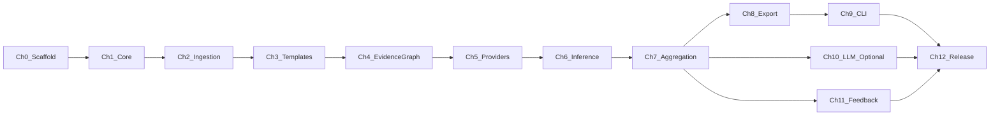

# Ontolog Unified Implementation Plan

## Vision (merged from both plans)

**Ontolog** transforms unstructured application logs into an **explainable, probabilistic domain model** with confidence scores and provenance. It is **not** a SIEM, log viewer, or LLM wrapper — it is a **library-first inference engine**.

**Core principles** (non-negotiable across all chapters):

- Deterministic core first — full pipeline works without any LLM
- LLMs are optional evidence providers, never the source of truth
- Templates (via Drain3) are the semantic boundary between raw logs and inference
- Graph-native representation — Pydantic/JSON Schema/Mermaid are derived exports
- Human feedback is first-class evidence with highest weight

**Target MVP outcome** (controlboard logs fixture):

```
Entities: ControlBoard, Interface
Events: PacketSent, PacketReceived, ConnectionEstablished
Fields: payload (bytes, ~0.98), destination (IPv4Address, 1.0)
Relationship: ControlBoard owns Interface
```

Each claim must carry confidence + provenance trail.

---

## Repository structure (modeled on pulq)

```text
ontolog/
├── src/ontolog/              # src layout (like pulq/src/pulq/)
│   ├── __init__.py           # public API + __version__
│   ├── types.py              # Protocols, type aliases
│   ├── errors.py
│   ├── config.py             # Pydantic settings
│   ├── models/               # LogRecord, Template, Evidence, DomainModel
│   ├── ingestion/            # parsers, preprocessor registry
│   ├── templates/            # Drain3 adapter, masking, store
│   ├── evidence/             # EvidenceGraph, provider base
│   ├── providers/            # deterministic + semantic providers
│   ├── inference/            # aggregation, event/entity/relationship/state
│   ├── export/               # pydantic, json-schema, mermaid, graphml
│   ├── feedback/             # human correction evidence
│   ├── storage/              # SQLite persistence
│   └── cli/                  # Typer entry point: ontolog
├── tests/
│   ├── conftest.py
│   ├── unit/
│   ├── integration/
│   └── fixtures/             # controlboard.log, loghub/ 2k slices, synthetic
├── docs/                     # Sphinx + MyST (like pulq/docs/)
├── examples/                 # runnable demos
├── benchmarks/               # template + inference perf + accuracy vs LogHub-2.0
├── scripts/
│   └── fetch_corpora.py      # on-demand LogHub download (Zenodo)
├── .github/workflows/        # ci.yml, release.yml, publish.yml
├── .github/dependabot.yml
├── .pre-commit-config.yaml
├── .readthedocs.yaml
├── pyproject.toml            # single config source
├── README.md
├── CHANGELOG.md
├── CONTRIBUTING.md
└── LICENSE
```

**Tooling parity with pulq:**

| Concern | Choice |
|---------|--------|
| Python | `>=3.11` (CI matrix 3.11 + 3.12) |
| Build | setuptools src layout |
| Lint/format | Ruff |
| Types | mypy strict |
| Tests | pytest + pytest-cov + hypothesis |
| CLI | Typer + Rich; entry point `ontolog` |
| Docs | Sphinx + MyST + RTD theme; hosted at `ontolog.readthedocs.io` |
| CI | GitHub Actions: ruff, mypy, pytest+coverage, Sphinx `-W`, wheel smoke test |
| Release | Tag `v<version>` from pyproject on merge to main; PyPI OIDC trusted publishing |
| Coverage | Codecov upload from CI |
| Optional extras | `semantic`, `graph`, `dev`, `docs` |

**Core dependencies:** `pydantic>=2`, `drain3`, `networkx`, `typer`, `rich`, `typing-extensions`

---

## Benchmark corpora (testing and evaluation)

Ontolog is **not** an ML training project. Public corpora are used for **regression testing**, **template-mining benchmarks**, **provider/inference smoke tests**, and **optional performance runs**.

### Primary source: LogHub

[LogHub](https://github.com/logpai/loghub) (Zenodo [8196385](https://zenodo.org/records/8196385)): **19 real-world, line-based datasets** (~77 GB total).

| Tier | Datasets | Use in Ontolog |
|------|----------|----------------|
| **CI fixtures** | Apache, Linux, Zookeeper, HPC | Committed 2k slices in `tests/fixtures/loghub/` |
| **Integration** | HealthApp, OpenSSH, Spark | `pytest -m corpus` after `fetch_corpora.py` |
| **Benchmark** | HDFS_v1, BGL, Hadoop | Manual/nightly `benchmark.yml` |
| **Out of scope (V1)** | Thunderbird, HDFS_v2 | Documented as optional |

### Template ground truth: LogHub-2.0

[LogHub-2.0](https://github.com/logpai/loghub-2.0) (Zenodo [8275861](https://zenodo.org/record/8275861)) provides annotated template labels for parsing benchmarks.

---

## Implementation chapters

Each chapter ends with **verifiable acceptance criteria** — CI must stay green before moving on.

### Chapter 0 — Repository scaffold and engineering baseline

**Status:** completed (merged in PR #1)

**Goal:** Empty-but-runnable Python library project with green CI/CD, matching pulq conventions.

**Deliverables:**
- `pyproject.toml` with project metadata, `[dev]`/`[docs]` extras, ruff/mypy/pytest/coverage config
- `src/ontolog/__init__.py` with `__version__` and `py.typed`
- `.github/workflows/ci.yml`, `release.yml`, `publish.yml`, `dependabot.yml`
- `.pre-commit-config.yaml` (ruff hooks)
- `.readthedocs.yaml` + minimal `docs/` (index, getting_started, architecture stub)
- `README.md` with badges
- `CHANGELOG.md`, `CONTRIBUTING.md`, `.gitignore` (include `data/`)
- `tests/fixtures/loghub/README.md` — provenance and citation

**Verify:**
- [x] `pip install -e ".[dev]"` succeeds
- [x] `ruff check`, `ruff format --check`, `mypy src`, `pytest` all pass
- [x] `sphinx-build -W docs _build/html` passes
- [x] GitHub Actions CI green on `main`
- [x] `python -c "import ontolog"` works after wheel build

### Chapter 1 — Core models, config, and CLI skeleton

**Status:** pending

See full chapter details in plan history. Deliverables: `LogRecord`, `config.py`, `errors.py`, `ontolog --version`.

### Chapters 2–12

**Status:** pending — see sections in original unified plan for full acceptance criteria per chapter.

**MVP boundary:** Chapters 0–9 + Chapter 12 (without 10–11).

---

## Chapter dependency graph



---

## Explicit non-goals (V1)

- Web UI / dashboard
- SIEM, alerting, log viewer
- Real-time streaming / OpenTelemetry collector
- Distributed deployment
