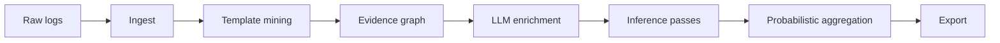
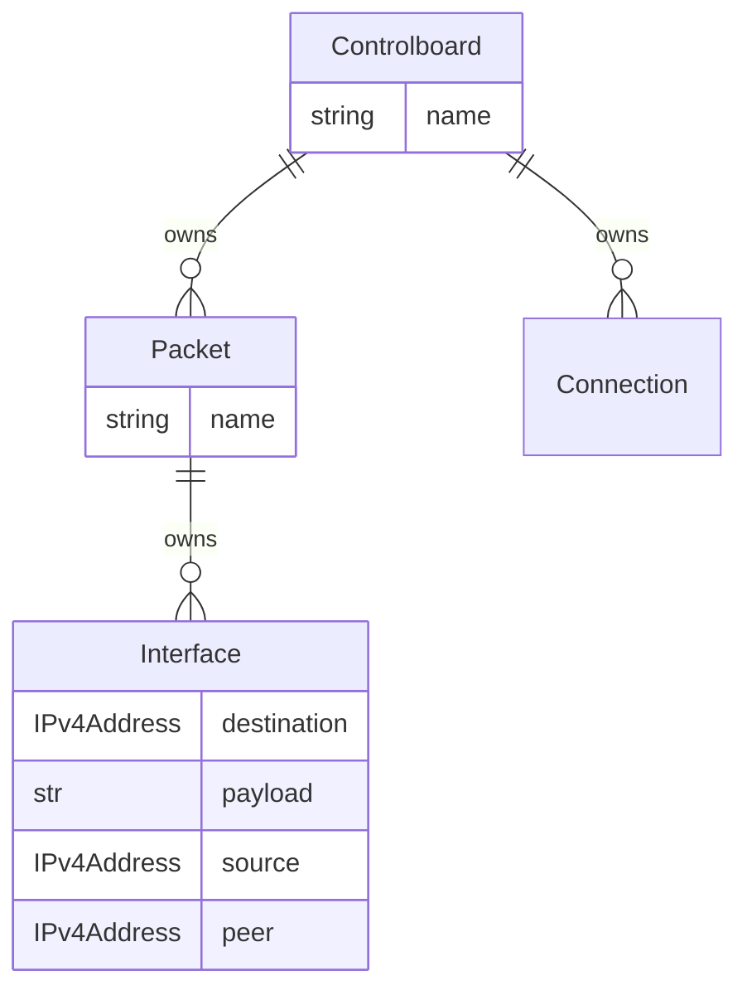
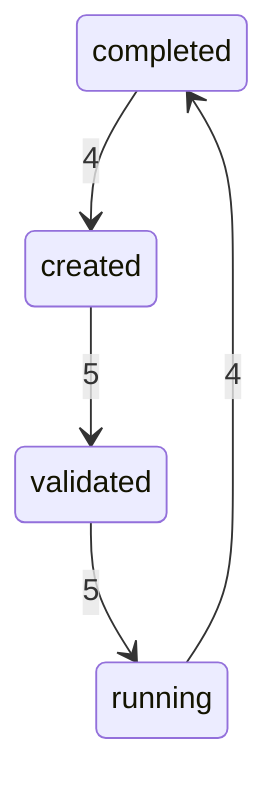

# Ontolog

**Infer domain models from logs — deterministic evidence first, export anywhere**

[](https://github.com/vadim-schultz/ontolog/actions/workflows/ci.yml)
[](https://ontolog.readthedocs.io/en/latest/?badge=latest)
[](https://codecov.io/gh/vadim-schultz/ontolog)
[](https://pypi.org/project/ontolog/)
[](https://pypi.org/project/ontolog/)
[](https://github.com/vadim-schultz/ontolog/blob/main/LICENSE)
[](https://github.com/astral-sh/ruff)
[](https://mypy-lang.org/)
[](https://github.com/vadim-schultz/ontolog/blob/main/pyproject.toml)

Ontolog turns raw application logs into a **probabilistic domain model** — entities, events,
typed fields, relationships, and state machines — with confidence scores and provenance on every
claim. The full pipeline is implemented today: ingestion, template mining, evidence accumulation,
inference, aggregation, and export to Pydantic, JSON Schema, Mermaid, GraphML, and more.

```bash
ontolog infer app.log --format mermaid
```

Technical reference: [Read the Docs](https://ontolog.readthedocs.io) ·
[Architecture](docs/architecture.md) · [Export formats](docs/export.md)

---

## The problem

Every system eventually needs a schema for "what's in our logs." Today that schema is almost always
**hand-written** — a Pydantic model per log type, a parser registry, and a frontend type file that
mirrors the backend by hand. It works until the application changes, a new device shows up, or a
field silently drifts. Then parsers break, displays show wrong shapes, and nobody notices until
someone files a bug.

Ontolog inverts that: **start from the logs, infer the schema, export it everywhere you need it.**

---

## How it works



Each stage produces a concrete artifact that feeds the next. Below, one line from the
[`controlboard.log`](tests/fixtures/controlboard.log) fixture walks through the full chain.

### 1. Ingest

**Input:** unstructured or semi-structured log lines (syslog, JSONL, plain text).

```
2024-01-15T12:00:01.000Z cb-host controlboard[1001]: INFO PacketSent interface=eth0 destination=192.168.1.10 payload=0xdeadbeef
```

**Output:** a normalized `LogRecord` — one Pydantic object per line, fed to template mining.

```json
{
  "timestamp": "2024-01-15T12:00:01Z",
  "hostname": "cb-host",
  "process": "controlboard",
  "pid": 1001,
  "level": "INFO",
  "logger": null,
  "message": "PacketSent interface=eth0 destination=192.168.1.10 payload=0xdeadbeef"
}
```

### 2. Template mining

**Input:** `LogRecord.message` strings from ingest.

Drain3 compresses repeating messages into stable templates. Variable tokens are masked
(`<IP>`, `<HEX>`, `<UUID>`, …) and each match records extracted parameters.

**Output:** a `Template` catalog entry plus per-line `TemplateOccurrence` rows (stored in SQLite).

```json
{
  "id": "cluster_1",
  "template": "PacketSent interface=eth0 destination=<IP> payload=<HEX>",
  "occurrence_count": 20,
  "first_seen": "2024-01-15T12:00:01Z",
  "last_seen": "2024-01-15T12:00:01.738000Z"
}
```

```json
{
  "template_id": "cluster_1",
  "timestamp": "2024-01-15T12:00:01Z",
  "message": "PacketSent interface=eth0 destination=192.168.1.10 payload=0xdeadbeef",
  "parameters": [
    { "name": "IP", "value": "192.168.1.10" },
    { "name": "HEX", "value": "0xdeadbeef" }
  ],
  "process": "controlboard"
}
```

Three templates emerge from the full fixture: `PacketSent`, `PacketReceived`, and
`ConnectionEstablished`.

### 3. Evidence accumulation

**Input:** all `Template` and `TemplateOccurrence` rows from the store.

Six deterministic providers analyze templates and occurrences, populating a scored
`EvidenceGraph` (nodes + edges with provenance). Decision rules for each provider and how they
feed entity, event, field, relationship, and state inference are unified in
[How domain concepts are decided](#how-domain-concepts-are-decided) below.

| Provider | What it finds |
|----------|---------------|
| Namespace | Process name → entity; template prefix → event; parameters → fields |
| Regex | IPv4, hex, UUID, MAC, email, URL, path, timestamp patterns |
| Statistics | How often each parameter value appears, how many distinct values exist, and how varied they are — see below |
| Co-occurrence | Parameters appearing together in the same message |
| Temporal | Ordered template sequences by timestamp |
| Process | Repeated template subsequences (activity patterns) |

**What the statistics provider does, in plain terms.** For every extracted parameter (e.g.
`destination` on the `PacketSent` template), Ontolog looks at *all* values seen across the log
corpus and asks three simple questions:

- **How often does the most common value show up?** If `interface=eth0` appears in every line,
  that parameter looks stable and intentional — good signal that it belongs in the model. If every
  line has a different IP, no single value dominates, which is still useful context.
- **How many distinct values are there?** A parameter that always has one value (cardinality 1)
  behaves like a constant or enum. A parameter with dozens of unique values behaves like an
  identifier or address list.
- **How spread out are the values?** High variety means the parameter carries a lot of information
  per message (typical for IDs, IPs, timestamps). Low variety means the log is repetitive on that
  slot.

Statistics does not guess types on its own (regex does that). It **strengthens** evidence already
on a field: the more log lines back up a typing decision, the higher the confidence score becomes.
That reinforced score flows into field inference and aggregation, so a type like `ipv4` for
`destination` ends up at confidence 1.0 instead of relying on a single regex match alone.

#### How domain concepts are decided

Evidence providers and inference passes play different roles. **Providers** scan templates and
occurrences and write scored nodes and edges into the evidence graph. **Inference passes** read
that graph and promote the strongest signals into domain concepts. The table below is the single
reference for both layers.

| Concept | Evidence providers (what they add to the graph) | Inference pass (how it becomes a domain claim) |
|---------|--------------------------------------------------|------------------------------------------------|
| **Entity** | **Namespace** creates an `entity` node from the syslog process name (`controlboard` → `entity:controlboard`). | **Entity pass** promotes every `entity` node whose combined evidence clears the confidence threshold. It also infers extra entities: a field named `interface` linked across templates becomes `Interface`; when two or more events share a noun prefix (`packetsent` + `packetreceived` → `packet`), that noun becomes an entity (`Packet`). |
| **Event** | **Namespace** creates an `event` node from the first word of each template (`PacketSent …` → `event:packetsent`). | **Event pass** promotes every `event` node above threshold and tags lifecycle verbs from the slug (`sent` → `send`, `received` → `receive`, `established` → `connect`). |
| **Field** | **Namespace** creates `field` nodes from `name=value` parameters and `has_field` edges to the owning entity. **Regex** matches parameter *values* against type patterns and adds `has_type` edges (`field → type:ipv4`). **Statistics** attaches reinforcement evidence to existing field nodes. | **Field pass** promotes fields with a resolved type (via `has_type`) and a valid name. It maps semantic names from the template text (`destination=<IP>`) onto typed mask tokens (`IP` → `ipv4`), so the exported field is `destination: ipv4` rather than raw `IP: ipv4`. Closed `status` value sets become enum types. |
| **Relationship** | **Namespace** `has_field` edges are the structural signal. **Co-occurrence** adds `co_occurs` edges between fields that appear in the same message (graph context; not yet promoted to export). | **Relationship pass** infers `owns` when a `has_field` edge points at a *structural* field name (today: `interface` → `Controlboard` owns `Interface`). When one process owns all occurrences and multiple events share a noun prefix, it also infers `Controlboard` owns `Packet`. |
| **State** | **Temporal** adds `follows` edges between consecutive templates (ordered by timestamp). Status values appear as ordinary field parameters. | **State pass** watches ordered `status=…` values and `follows` edges, counts adjacent pairs (`created` → `validated`), and builds a state machine when pairs repeat enough times (minimum support: 2). |

**Providers that enrich the graph without a direct export today:**

| Provider | Decision rule | Role in inference |
|----------|---------------|-------------------|
| **Co-occurrence** | Any two parameters in the same log line get a `co_occurs` edge; score grows with how often they appear together. | Stays on the evidence graph for analysis and future relationship mining. |
| **Process** | Sliding windows of three consecutive templates are counted; subsequences repeated at least twice get a `repeats_in_process` edge. | Activity-pattern signal on the graph; not yet promoted to domain relationships. |
| **Temporal** | Sort occurrences by timestamp; each adjacent pair of *different* templates gets a `follows` edge. | Feeds **state inference** when template prefixes map to lifecycle labels (`OrderCreated` → `created`). |
| **LLM (optional)** | User-defined provider attaches annotations to existing nodes. | Lowest evidence tier; can suggest semantics but never overrides deterministic or human evidence. |

On the controlboard fixture this chain looks like: process `controlboard` → entity **Controlboard**;
template prefix `PacketSent` → event **Packetsent**; parameter `destination=192.168.1.10` → field
**destination** typed **ipv4**; field name `interface` → entity **Interface** + relationship
**Controlboard owns Interface**; shared noun `packet` from two events → entity **Packet**.

**Output:** graph nodes and edges — fed to inference passes (and optionally LLM providers).

```json
{
  "nodes": [
    {
      "id": "entity:controlboard",
      "kind": "entity",
      "label": "Controlboard",
      "evidence": [
        {
          "source": "namespace",
          "score": 0.8,
          "explanation": "Entity inferred from process name 'controlboard'"
        }
      ]
    },
    {
      "id": "field:cluster_1:destination",
      "kind": "field",
      "label": "destination",
      "evidence": [
        {
          "source": "namespace",
          "score": 0.7,
          "explanation": "Field 'destination' linked to entity 'controlboard'"
        }
      ]
    },
    {
      "id": "type:ipv4",
      "kind": "type",
      "label": "ipv4",
      "evidence": [
        {
          "source": "regex",
          "score": 0.95,
          "explanation": "Parameter value matches ipv4 pattern",
          "samples": ["192.168.1.10", "192.168.1.13", "192.168.1.14"]
        }
      ]
    }
  ],
  "edges": [
    {
      "source_id": "entity:controlboard",
      "target_id": "field:cluster_1:destination",
      "label": "has_field"
    },
    {
      "source_id": "field:cluster_1:ip",
      "target_id": "type:ipv4",
      "label": "has_type"
    }
  ]
}
```

### 4. LLM enrichment (optional)

**Input:** the populated `EvidenceGraph` from step 3.

User-provided LLM providers can attach semantic annotations as additional graph evidence.
They sit at the **lowest evidence tier** and never override deterministic findings or human
corrections. When no LLM provider is configured, the graph passes through unchanged.

**Output (when enabled):** additional `Evidence` entries on existing nodes — same graph shape,
extra annotations:

```json
{
  "source": "llm",
  "score": 0.6,
  "explanation": "Field 'destination' likely represents a remote network endpoint"
}
```

### 5. Inference

**Input:** the `EvidenceGraph` plus template/occurrence data.

Five passes read the graph and apply the promotion rules in
[How domain concepts are decided](#how-domain-concepts-are-decided) above. Each pass outputs
candidates only when combined evidence clears a configurable confidence threshold.

| Pass | Produces |
|------|----------|
| Entity | `Controlboard`, `Interface`, `Packet` |
| Event | `PacketSent`, `PacketReceived`, `ConnectionEstablished` |
| Field | `destination: ipv4`, `payload: hex`, `peer: ipv4`, … |
| Relationship | `Controlboard` owns `Interface` |
| State | Lifecycle transitions (see [order lifecycle](#state-machines) below) |

**Output:** an `InferenceResult` bundle — fed to probabilistic aggregation.

```json
{
  "entities": [
    {
      "name": "Controlboard",
      "slug": "controlboard",
      "confidence": 0.8,
      "graph_node_id": "entity:controlboard",
      "evidence": [
        {
          "source": "namespace",
          "score": 0.8,
          "explanation": "Entity inferred from process name 'controlboard'"
        }
      ]
    }
  ],
  "events": [
    {
      "name": "Packetsent",
      "slug": "packetsent",
      "verbs": ["send"],
      "confidence": 0.75,
      "graph_node_id": "event:packetsent"
    }
  ],
  "fields": [
    {
      "name": "destination",
      "type_name": "ipv4",
      "confidence": 1.0,
      "graph_node_id": "field:cluster_1:destination",
      "entity_slug": "interface",
      "evidence": [
        {
          "source": "regex",
          "score": 0.95,
          "explanation": "Parameter value matches ipv4 pattern",
          "samples": ["192.168.1.10", "192.168.1.13", "192.168.1.14"]
        }
      ]
    }
  ],
  "relationships": [
    {
      "kind": "owns",
      "source_name": "Controlboard",
      "target_name": "Interface",
      "confidence": 0.94
    }
  ]
}
```

### 6. Probabilistic aggregation

**Input:** the `InferenceResult` from step 5.

Conflicting evidence resolves by tier priority (`human` > `deterministic` > `LLM`), then by
weighted confidence within the winning tier.

**Output:** a `ProbabilisticDomainModel` — the canonical source of truth, fed to exporters.

```json
{
  "entities": [
    {
      "name": "Interface",
      "slug": "interface",
      "confidence": 0.93,
      "export_eligible": true,
      "graph_node_id": "entity:interface"
    }
  ],
  "fields": [
    {
      "name": "destination",
      "type_name": {
        "value": "ipv4",
        "confidence": 1.0,
        "export_eligible": true,
        "evidence": [
          {
            "source": "regex",
            "score": 0.95,
            "explanation": "Parameter value matches ipv4 pattern",
            "samples": ["192.168.1.10", "192.168.1.13", "192.168.1.14"]
          }
        ]
      },
      "entity_slug": "interface",
      "graph_node_id": "field:cluster_1:destination"
    }
  ],
  "relationships": [
    {
      "kind": "owns",
      "source_name": "Controlboard",
      "target_name": "Interface",
      "confidence": 0.87,
      "export_eligible": true
    }
  ]
}
```

Each claim carries `confidence`, `evidence`, and `export_eligible` — only high-confidence
claims appear in default exports.

### 7. Export

**Input:** the `ProbabilisticDomainModel` from step 6 (plus the evidence graph for graph-aware
formats).

Exporters render filtered views of the domain model into developer-facing artifacts. See
[The result](#the-result) below for full examples across formats.

---

## The result

Running `ontolog infer tests/fixtures/controlboard.log --format mermaid` on the fixture above
renders step 7 export artifacts from the aggregated domain model.
### Entity-relationship diagram



### Generated Pydantic model

```python
class Interface(BaseModel):
    """Inferred entity (confidence=0.93)."""

    destination: IPv4Address = Field(description='IPv4 address (confidence=1.00)')
    payload: str = Field(
        description='hexadecimal string (confidence=1.00)',
        pattern='^[0-9a-fA-F]+$',
    )
    source: IPv4Address = Field(description='IPv4 address (confidence=1.00)')
    peer: IPv4Address = Field(description='IPv4 address (confidence=1.00)')

class Packet(BaseModel):
    """Inferred entity (confidence=0.87)."""

    interface: Interface = Field(description='owns Interface (confidence=0.76)')

class Controlboard(BaseModel):
    """Inferred entity (confidence=0.68)."""

    packet: Packet = Field(description='owns Packet (confidence=0.92)')
```

Generated code passes `ruff` and `mypy --strict`.

### JSON Schema fragment

Nested under `Controlboard.packet.interface`:

```json
"destination": {
    "type": "string",
    "format": "ipv4",
    "description": "Inferred field type ipv4 (confidence=1.00)"
},
"payload": {
    "type": "string",
    "pattern": "^[0-9a-fA-F]+$",
    "description": "Inferred field type hex (confidence=1.00)"
}
```

### State machines

On [`order_lifecycle.log`](tests/fixtures/order_lifecycle.log), temporal evidence infers a
lifecycle:



---

## Proof, not promises

Measured on committed [LogHub](https://github.com/logpai/loghub) fixtures. Full methodology:
[docs/benchmarks.md](docs/benchmarks.md).

**Template accuracy** (pairwise clustering F1 vs. LogHub-2.0 labels):

| Dataset | Precision | Recall | F1 |
|---------|-----------|--------|-----|
| Apache | 1.000 | 1.000 | 1.000 |
| OpenSSH | 0.995 | 1.000 | 0.998 |

**Throughput** (Python 3.11, single-threaded):

| Fixture | Lines/sec | Templates | Time |
|---------|-----------|-----------|------|
| controlboard.log | 511 | 3 | 0.12s |
| apache_2k.log | 932 | 6 | 2.15s |

**Inference latency:**

| Fixture | Total | Events inferred |
|---------|-------|-----------------|
| controlboard.log | 117ms | 3 |
| order_lifecycle.log | 35ms | 4 |

---

## Where this fits

Ontolog is a library, not a SIEM or log viewer. It sits in the **model layer** — between raw
telemetry and the systems that consume typed schemas.

### From static models to inferred models

Model-driven platforms (test management, device orchestration, pipeline analytics) already define
schemas for parameters, log artifacts, and display adapters. That works well when the domain is
stable. It breaks when:

- A new device or firmware revision emits log lines nobody modeled yet
- A field rename or type change slips through because the hand-written parser still accepts the old shape
- Backend Pydantic models and frontend TypeScript types drift apart

Ontolog closes that gap by **inferring schemas from observed data** and exporting them in the
formats your stack already uses.

### Suggested uses

**Replace or augment hand-maintained log parsers.** Instead of writing a new `LogParser` subclass
and Pydantic model for every log type, run Ontolog on a representative corpus, review the inferred
model, and promote it to production. Drift shows up as new templates or confidence drops — not
silent parse failures.

**Bootstrap frontend types from inferred schemas.** Today many teams hand-mirror backend models in
TypeScript. Ontolog already exports JSON Schema; a planned `typescript` export target would
generate interfaces directly from the inferred domain model, keeping display adapters and form
validators in sync with what the logs actually contain.

**Onboard new log streams without a parser sprint.** Point Ontolog at device logs, test-bench
output, or CI artifacts from a system you do not own yet. Get entities, fields, and relationships
in minutes instead of days of schema design.

**Human-in-the-loop governance.** Reviewers confirm or correct inferred fields; corrections become
top-tier evidence that overrides lower-confidence findings. The schema converges over time instead
of needing to be perfect on day one.

**Root-cause analysis over the evidence graph.** The populated evidence graph (exportable as JSON
or GraphML) links every claim back to the templates and occurrences that support it — a natural
foundation for MCP-backed investigation workflows.

### Export formats available today

| Format | Use case |
|--------|----------|
| `pydantic` | Importable Python `BaseModel` source |
| `json-schema` | Validation, OpenAPI, frontend codegen input |
| `mermaid` | ER diagrams and state machines in docs or wikis |
| `markdown` | Human-readable report with confidence percentages |
| `graphml` | NetworkX-compatible graph for analysis tools |
| `domain-json` | Full probabilistic domain model as JSON |
| `evidence-graph` | Provenance-backed evidence graph as JSON |
| `full` | Domain model + evidence graph + template summary |

See [docs/export.md](docs/export.md) for CLI and library API details.

---

## Install

```bash
pip install ontolog
```

## Development

```bash
git clone https://github.com/vadim-schultz/ontolog.git
cd ontolog
python -m venv .venv && source .venv/bin/activate
pip install -e ".[dev]"
pytest
```

## Documentation

- [Read the Docs](https://ontolog.readthedocs.io)
- [Getting started](docs/getting_started.md)
- [Architecture](docs/architecture.md)
- [Contributing](CONTRIBUTING.md)

## License

MIT — see [LICENSE](LICENSE).
